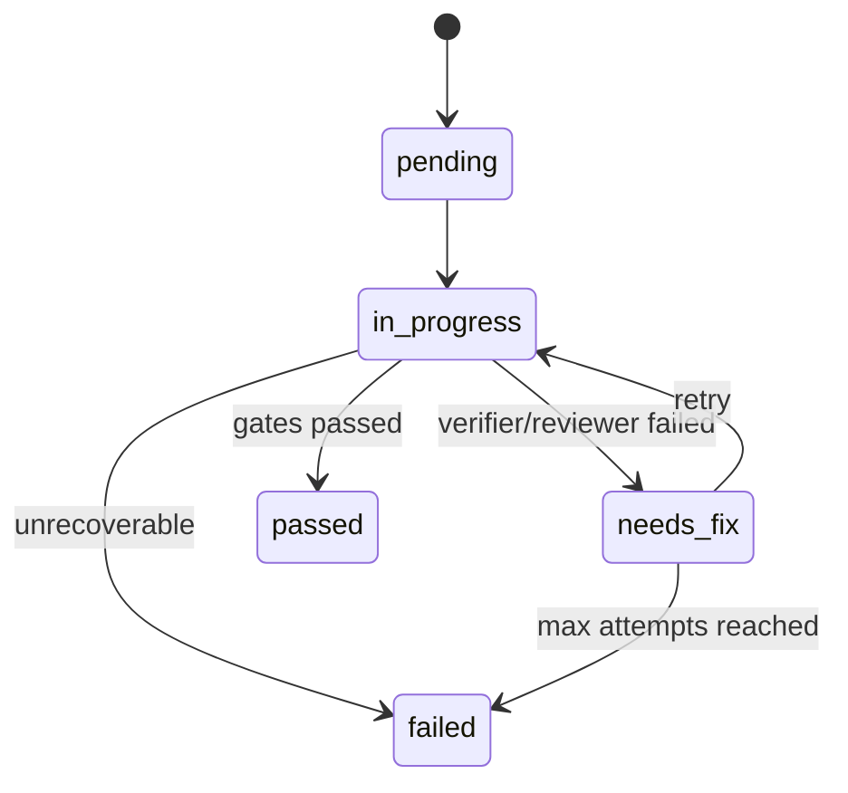
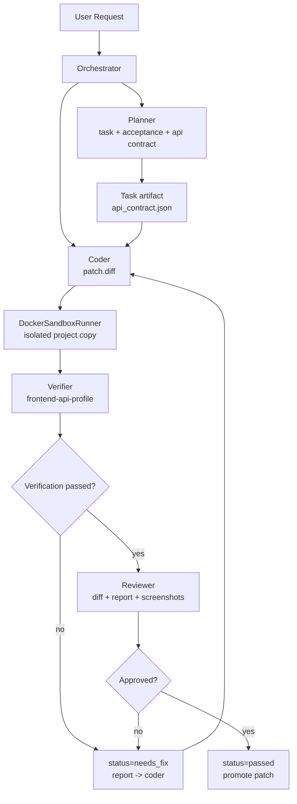

# 第 8 步：受控 Agent Workflow 状态机设计

这份文档解释第 8 步：为什么多 agent 协作不应该一开始做成“多个 agent 自由聊天”，
UI 组件 + API 联调时真正需要控制的是什么，任务状态为什么要保持少量，`status / phase /
owner / artifacts` 如何分工，以及面试时怎么讲。

核心结论：

> 多 agent 不是重点，受控工作流才是重点。Main/Orchestrator 维护唯一状态机，
> Planner/Coder/Verifier/Reviewer 只是受控角色。Agent 只能提交 artifact，不能随便改全局状态。

## 1. 常规设计思路

最容易想到的是固定 4 个 agent：

```text
Planner:  拆任务，定义验收标准
Coder:    写代码，只处理当前 task
Tester:   生成测试，执行 verifier
Reviewer: 看 diff、日志、风险，决定是否返工
```

协作协议：

```text
1. 主 agent 创建 task
2. coder 认领 task
3. coder 返回 diff summary
4. tester 跑验证
5. 失败则日志回 coder
6. 成功则 reviewer 审查
7. reviewer 通过后主 agent 合并结果
```

这个方向是对的，但如果直接实现成多个自治 agent，会很快失控。

## 2. 执行后会碰到的问题

如果 Planner/Coder/Tester/Reviewer 都能自由读写任务状态，会出现：

- Coder 还没提交 patch，Tester 就开始验证
- Verifier 失败了，但 Reviewer 以为可以 review
- 同一个 task 被多个角色同时修改
- 失败重试次数没人统一控制
- agent 之间互相发消息，主状态反而不清楚
- 状态过多，最终像一个难维护的 Jira

所以第 8 步不应该先做“多 agent 自由协作”，而应该先做：

```text
Orchestrator-controlled workflow state machine
```

## 3. 技术取舍

### 取舍 1：状态少，不做复杂状态枚举

不推荐一开始设计很多状态：

```text
ready
patch_ready
verifying
reviewing
approved
promoted
blocked
...
```

状态太多会让流转规则爆炸。更好的设计是：

```text
status = 任务整体结果状态
phase = 当前执行阶段
owner = 当前负责角色
artifacts = 当前产物
```

所以最小 status 只保留 5 个：

```text
pending
in_progress
needs_fix
passed
failed
```

含义：

- `pending`：等待执行
- `in_progress`：当前正在处理
- `needs_fix`：验证或 review 失败，需要 Coder 修
- `passed`：验证和 review 都通过
- `failed`：超过重试次数，或遇到不可恢复问题

### 取舍 2：phase 表示细节，不塞进 status

例如一个任务当前正在验证：

```json
{
  "status": "in_progress",
  "phase": "verifying",
  "owner": "verifier"
}
```

当前正在 review：

```json
{
  "status": "in_progress",
  "phase": "reviewing",
  "owner": "reviewer"
}
```

这样 status 不膨胀，phase 仍能表达执行细节。

### 取舍 3：Agent 不直接改状态，只提交 artifact

每个角色只提交自己的产物：

- Planner 提交 `TaskPlan` / `AcceptanceCriteria`
- Coder 提交 `patch.diff` / `diff_summary`
- Verifier 提交 `verification-report.json` / screenshots
- Reviewer 提交 `review_decision.json`

状态流转由 Orchestrator 根据 artifact 和 gate 结果决定。

## 4. 推荐任务结构

```json
{
  "id": "task_007",
  "type": "ui_api_integration",
  "owner": "coder",
  "status": "needs_fix",
  "phase": "verification",
  "attempts": 1,
  "max_attempts": 3,
  "depends_on": [],
  "context_refs": ["api_contract.json"],
  "artifacts": {
    "patch": ".sandbox/runs/run_001/patch.diff",
    "verification_report": ".sandbox/runs/run_001/outputs/verification-report.json",
    "screenshots": [
      ".sandbox/runs/run_001/outputs/screenshot-desktop.png"
    ]
  },
  "result": {
    "reason": "browser console error",
    "next_action": "fix undefined field mapping"
  }
}
```

这里的设计重点：

- `status` 少而稳定
- `phase` 表示当前阶段
- `owner` 表示当前角色
- `artifacts` 表示角色产物
- `attempts/max_attempts` 控制修复循环

## 5. 状态流转

```text
pending -> in_progress
in_progress -> needs_fix
needs_fix -> in_progress
in_progress -> passed
in_progress -> failed
needs_fix -> failed
```

图：



## 6. UI 组件 + API 联调流程

UI 组件接接口时，重点不是多 agent 数量，而是 gate 是否清楚。

推荐流程：

```text
1. Planner 定义需求、API contract、验收标准
2. Coder 在 sandbox 副本中写 UI component 和 API client
3. Verifier 使用 frontend-api-profile 验证
4. 失败则 report 回 Coder
5. 成功则 Reviewer 看 diff、report、截图和风险
6. Orchestrator 通过后 promote patch
```

数据流：



## 7. frontend-api-profile 需要测什么

普通前端 profile：

- install
- typecheck
- build
- test
- browser screenshot
- console errors

UI + API profile 要额外覆盖：

- API contract 是否存在
- mock response 是否符合 contract
- loading state 是否显示
- success state 是否显示
- error state 是否显示
- empty state 是否显示
- 可选 real API smoke test

如果真实接口不可用：

- 不要让任务卡死
- 用 mock API 跑 UI 状态
- 在 `open_issues` 里记录 real API 未验证

## 8. Orchestrator 决策规则

Orchestrator 的规则应该很简单：

- `pending` 任务没有依赖时进入 `in_progress`
- Coder 产出 patch 后进入 `phase=verifying`
- Verifier 报告失败时进入 `needs_fix`
- `needs_fix` 且 `attempts < max_attempts` 时回到 Coder
- `needs_fix` 且 `attempts >= max_attempts` 时进入 `failed`
- Verifier 通过后进入 `phase=reviewing`
- Reviewer 通过后进入 `passed`
- Reviewer 拒绝后进入 `needs_fix`

关键原则：

- Coder 不决定自己是否通过
- Verifier 不修改源码，只产出报告
- Reviewer 不执行命令，只判断风险
- Orchestrator 是唯一状态写入者

## 9. 面试讲法

可以这样讲：

> 我不会让多个 agent 自由协作，因为那样状态不可控。我会让 Orchestrator 维护唯一任务状态机。
> Planner 只产出任务和验收标准，Coder 只提交 patch，Verifier 只提交验证报告，Reviewer
> 只提交 review decision。任务状态只保留 pending、in_progress、needs_fix、passed、failed
> 五个，具体阶段用 phase 表示，产物用 artifacts 表示。这样既能表达多角色协作，又不会把状态机做爆。

一句话总结：

> 少量 status + phase + artifacts，比一大堆 status 更好维护。

## 10. 面试官可能追问

**为什么不做真正并发多 agent？**

因为当前目标是前端 UI 改动验证闭环。并发多 agent 会带来锁、冲突、状态竞争，收益不高。
先做受控状态机更适合面试项目，也更接近 CI workflow。

**Tester 是 LLM agent 吗？**

不一定。当前更推荐 `Verifier + TestProfile`。测试质量先靠确定性工具，LLM 可以后续辅助生成测试。

**Reviewer 什么时候介入？**

Verifier 通过后再介入。否则 Reviewer 会浪费上下文去看明显 build/test 不通过的代码。

**真实 API 不可用怎么办？**

使用 mock API 验证 UI 状态，把 real API 未验证写入 open issue。不要让任务无限等待后端。

**为什么 status 不包含 verifying/reviewing？**

因为 verifying/reviewing 是阶段，不是任务结果。放到 phase 可以避免状态数量膨胀。

## 11. 当前建议

第 8 步如果后续落代码，不建议先做完整多 agent runtime。建议顺序：

- `WorkflowTask` 数据结构
- `WorkflowStateMachine`
- `Artifact` 协议
- `frontend-api-profile`
- Orchestrator 根据 Verifier/Reviewer artifact 推进状态
- 超过 `max_attempts` 后进入 `failed`

这能把 UI + API 联调讲清楚，同时复杂度可控。
