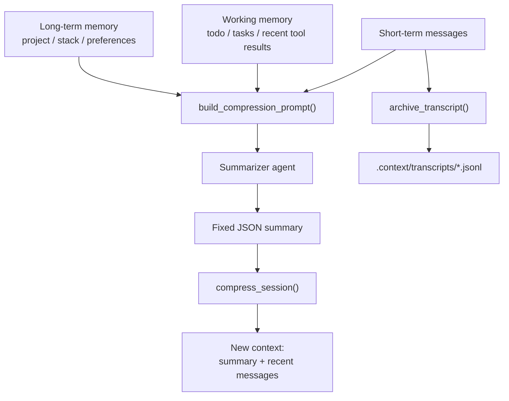
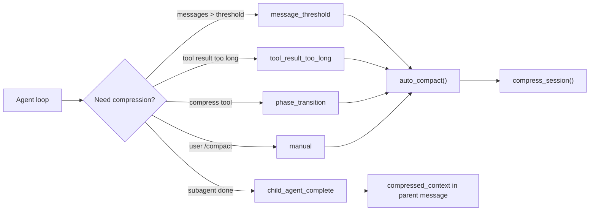
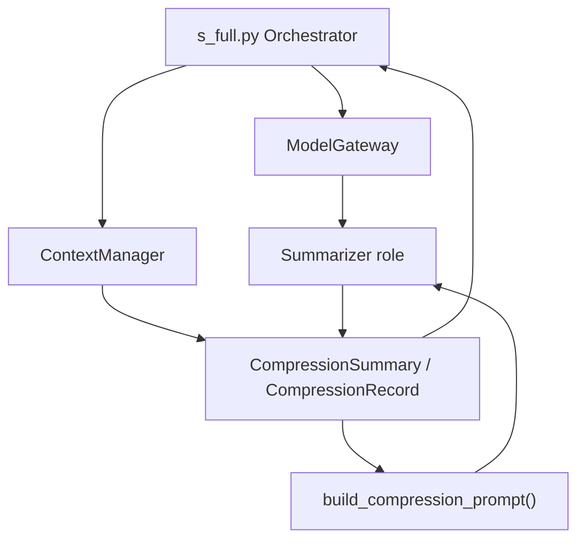

# 第 3 步：上下文压缩设计

这份文档解释第 3 步重构：为什么 coding agent 需要上下文压缩，项目里如何把
上下文分成四层，什么时候触发压缩，压缩产物为什么要固定 schema，以及面试时
应该怎么讲。

核心结论：

> 上下文压缩不是简单 summarize。它是把 agent 当前工作状态拆成短期上下文、
> 工作记忆、长期记忆和历史归档，再输出一个稳定 JSON summary，保证下一轮 agent
> 能继续工作，同时不把 transcript 和长日志继续塞进 prompt。

## 为什么需要这一层

原来的 `s_full.py` 里已经有 `microcompact()` 和 `auto_compact()`，但它们更像一个
临时止血方案：

- `microcompact()` 会清掉旧 tool result
- `auto_compact()` 会让模型总结整段 messages
- 总结结果是普通文本，不是稳定结构
- 没有区分当前任务、工具输出、项目长期信息和历史 transcript

这在 demo 里能跑，但在 coding agent 面试里会显得浅。因为真正的问题不是“怎么把
文本变短”，而是：

- 哪些上下文必须马上留在 prompt 里
- 哪些上下文应该变成工作记忆
- 哪些信息属于长期项目记忆
- 哪些历史只需要归档，必要时再查
- 压缩结果如何让下一轮 agent 稳定消费

第 3 步就是把这些东西显式建模。

## 四层上下文模型

现在项目里按四层理解上下文：

```text
1. 短期上下文：当前 agent messages
2. 工作记忆：当前 task、todo、recent tool results
3. 长期记忆：项目结构、技术栈、用户偏好
4. 历史归档：完整 transcript 存文件，只把 summary 放回上下文
```

对应代码里的位置：

| 层级 | 含义 | 代码来源 |
| --- | --- | --- |
| 短期上下文 | 当前 agent 的对话和最近工具结果 | `messages` |
| 工作记忆 | todo、task board、最近 tool result | `build_working_memory()` |
| 长期记忆 | 项目根目录、runtime 模块、目标技术栈 | `build_long_term_memory()` |
| 历史归档 | 完整 session transcript | `.context/transcripts/*.jsonl` |

数据流图：



## 固定压缩格式

压缩结果固定为 5 个字段：

```json
{
  "goal": "用户要生成一个可运行 React 网页",
  "decisions": ["使用 Vite + React + TS"],
  "files_changed": ["package.json", "src/App.tsx"],
  "open_issues": ["还没跑浏览器验证"],
  "next_actions": ["npm run build", "playwright verify"]
}
```

为什么要固定 schema：

- 下一轮 agent 可以稳定读取，不用猜自然语言总结里有没有关键信息
- Reviewer / Verifier 后续可以直接消费 `open_issues` 和 `next_actions`
- 面试时可以解释为“状态机式 summary”，而不是“随便总结一下”
- 测试可以检查字段完整性，降低压缩输出漂移

项目里用 `CompressionSummary` 表示这个固定结构：

```python
CompressionSummary(
    goal="用户要生成一个可运行 React 网页",
    decisions=["使用 Vite + React + TS"],
    files_changed=["package.json", "src/App.tsx"],
    open_issues=["还没跑浏览器验证"],
    next_actions=["npm run build", "playwright verify"],
)
```

`CompressionRecord` 则保存压缩事件本身：

- 哪个 session 被压缩
- 因为什么 trigger 被压缩
- transcript 归档路径
- working memory 快照
- long-term memory 快照
- 固定格式 summary

注意：放回 agent 上下文的只有 `summary`。working memory、long-term memory 和
transcript path 会保存在 `.context/summaries/*.compression.json` 里，方便调试和复盘。

## 触发条件

第 3 步支持四类触发：

| Trigger | 场景 | 项目里的接入点 |
| --- | --- | --- |
| `message_threshold` | messages 超过阈值 | `agent_loop()` 开头 |
| `tool_result_too_long` | 工具输出太长 | tool dispatch 后 |
| `child_agent_complete` | 子 agent 完成任务 | `SessionSummary.to_parent_message()` |
| `phase_transition` | 主 agent 准备进入下一阶段 | `compress` tool |
| `manual` | 用户手动 `/compact` | REPL 命令 |

压缩触发图：



## 和前两步的关系

第 1 步 `ModelGateway` 管模型调用，第 2 步 `ContextManager` 管 session 边界。
第 3 步是在 `ContextManager` 上继续加能力：当 session 变大时，如何把上下文变成
可继续工作的固定状态。



面试时可以这样串起来：

> 第一步我收敛模型调用，第二步我收敛上下文边界，第三步我处理上下文增长。
> 因为 coding agent 的问题不是一次生成，而是长任务持续执行。长任务里 messages、
> tool result、todo 和项目记忆会混在一起，所以我把上下文分层，再用固定 JSON
> 压缩成可恢复状态。

## 代码入口

主要代码：

- `harness/context_manager.py`
  - `CompressionSummary`
  - `CompressionRecord`
  - `ContextManager.build_compression_prompt()`
  - `ContextManager.compress_session()`
  - `ContextManager.normalize_compression_summary()`
  - `ContextManager.should_compress()`

- `agents/s_full.py`
  - `auto_compact()`
  - `build_working_memory()`
  - `build_long_term_memory()`
  - `has_long_tool_result()`
  - `recent_tool_results()`

- `tests/test_context_manager.py`
  - 固定 schema 测试
  - 四层 prompt 测试
  - trigger 测试
  - child agent 完成后 compressed context 测试

- `tests/test_s_full_background.py`
  - `auto_compact()` 写入固定 summary 的接入测试

## 一次压缩实际发生了什么

以 messages 超过阈值为例：

1. `agent_loop()` 调用 `estimate_tokens(messages)`
2. 超过 `TOKEN_THRESHOLD` 后触发 `auto_compact(trigger="message_threshold")`
3. `auto_compact()` 收集四层信息
4. `ContextManager.build_compression_prompt()` 构造固定 schema prompt
5. `Summarizer agent` 返回 JSON summary
6. `ContextManager.compress_session()` 归档完整 transcript
7. `.context/summaries/<session>.compression.json` 保存压缩记录
8. 当前 session messages 替换为 `context_summary + recent messages`
9. 下一轮 agent 继续执行，但不再携带完整历史

对应序列图：

```mermaid
sequenceDiagram
    participant Loop as "agent_loop"
    participant Auto as "auto_compact"
    participant Context as "ContextManager"
    participant Gateway as "ModelGateway"
    participant Summarizer as "Summarizer Model"
    participant Disk as ".context files"

    Loop->>Auto: "trigger=message_threshold"
    Auto->>Context: "build_compression_prompt(four layers)"
    Auto->>Gateway: "call_model('summarizer', prompt)"
    Gateway->>Summarizer: "provider request"
    Summarizer-->>Gateway: "fixed JSON summary"
    Gateway-->>Auto: "raw response"
    Auto->>Context: "compress_session(summary, trigger)"
    Context->>Disk: "archive full transcript"
    Context->>Disk: "write compression record"
    Context-->>Auto: "CompressionRecord"
    Auto-->>Loop: "summary message"
```

## 用到的设计模式

| 模式 | 在本步里的对应 | 作用 |
| --- | --- | --- |
| Snapshot | `CompressionRecord` | 把某一刻的 session 状态固定下来 |
| Memento | transcript archive | 保留完整历史，必要时恢复或审计 |
| Schema Contract | `CompressionSummary` | 约束 summary 输出，不让模型自由发挥 |
| Policy | compression trigger | 不同场景用不同触发原因 |
| Working Memory | `build_working_memory()` | 把当前任务状态从长对话中抽出来 |
| Long-term Memory | `build_long_term_memory()` | 保存跨任务稳定信息 |
| Event Log | `.context/transcripts/*.jsonl` | 完整历史只落盘，不污染 prompt |

这些模式在前端学习里不常被强调，但在 agent runtime 里很重要。因为 agent 不是一次性
函数调用，而是长时间、多轮、多工具的状态系统。

## 面试 2 分钟讲法

可以这样讲：

1. 我把上下文分成四层：短期 messages、工作记忆、长期记忆、历史归档。
2. 短期 messages 只保留当前需要继续推理的内容。
3. 工作记忆保存当前 task、todo 和 recent tool results。
4. 长期记忆保存项目结构、技术栈、用户偏好这类跨任务信息。
5. 完整 transcript 不继续塞进 prompt，而是归档成 JSONL。
6. 压缩时要求 summarizer 输出固定 JSON，包括 goal、decisions、files_changed、open_issues、next_actions。
7. 这样下一轮 agent 可以稳定恢复工作状态，而不是读一段不可控的自然语言总结。

一句话总结：

> 我把上下文压缩从“文本总结”变成“状态快照”。完整历史可审计，当前 prompt 只保留
> 可执行的 summary 和最近上下文。

## 按面试叙述展开

面试里更自然的讲法不是一上来报模块名，而是按“我先按常规方案做，发现问题，
再迭代解决”的路径讲。

### 1. 常规设计思路

一开始最直接的做法是维护一个 `messages` 数组。用户说一句、agent 回一句、工具执行结果
再 append 回去。Anthropic / OpenAI 的 chat-style API 都是这个形态，所以这个方案很自然：

```text
messages = [
  user request,
  assistant tool call,
  tool result,
  assistant next step,
  ...
]
```

如果上下文太长，就让模型总结一下：

```text
old messages -> summarizer -> summary -> new messages
```

这个方案实现快，也适合 demo。

### 2. 执行后碰到的问题

真正开始做 coding agent 后，这个方案会遇到几个问题：

- tool result 很容易特别长，比如 build log、test log、文件内容
- 子 agent 的探索过程会污染主 agent 上下文
- 简单自然语言 summary 不稳定，下一轮 agent 不一定能恢复工作状态
- todo、当前任务、项目技术栈这几类信息混在聊天记录里，没有明确边界
- 完整 transcript 如果不保存，出了问题无法复盘；如果全塞 prompt，token 会爆

所以问题不是“上下文太长”这么简单，而是“不同类型的信息生命周期不同”。

### 3. 解决方案

我把上下文拆成四层：

```text
短期上下文：当前 messages
工作记忆：当前 task、todo、recent tool results
长期记忆：项目结构、技术栈、用户偏好
历史归档：完整 transcript 存 JSONL 文件
```

压缩时不再让模型自由总结，而是要求输出固定 JSON：

```json
{
  "goal": "用户要生成一个可运行 React 网页",
  "decisions": ["使用 Vite + React + TS"],
  "files_changed": ["package.json", "src/App.tsx"],
  "open_issues": ["还没跑浏览器验证"],
  "next_actions": ["npm run build", "playwright verify"]
}
```

代码上对应：

- `CompressionSummary` 固定 summary schema
- `CompressionRecord` 记录一次压缩事件
- `build_compression_prompt()` 把四层上下文喂给 summarizer
- `compress_session()` 归档完整 transcript，只把 summary 放回 session

### 4. 解决效果

这个方案的效果是：

- prompt 里只保留可继续执行的状态，不继续塞完整历史
- build log / test log 可以归档，不会把 token 打爆
- 下一轮 agent 能稳定读取 `goal`、`open_issues`、`next_actions`
- 子 agent 完成后回传的是结构化 `compressed_context`
- 历史 transcript 仍然存在，方便 debug 和审计
- 后续 Verifier / Reviewer 可以直接消费这个 JSON，而不是重新理解一段自然语言总结

### 5. 如果面试官继续追问

可以继续说：

> 这一步还没有做复杂长期记忆检索。我现在先做的是上下文生命周期管理：
> 哪些留在 prompt，哪些变成工作记忆，哪些归档，哪些变成固定 summary。
> 后续如果扩展，可以把 `.context/summaries` 做 embedding index，再按任务检索注入。

这样讲的好处是：你没有假装一步做完 Claude Code，而是体现“先解决最容易失控的工程边界”。

## 面试官可能追问

**为什么压缩结果要固定 schema？**

因为后续 Planner、Reviewer、Verifier 都需要稳定读取字段。比如 Verifier 可以直接看
`next_actions`，Reviewer 可以直接看 `open_issues`。如果只是自然语言总结，每次格式都
不一样，后续自动化很难做。

**为什么不把 long-term memory 也放回 prompt？**

长期记忆不是每轮都需要完整进入 prompt。它应该作为可检索的背景信息，只有当前任务需要
时再注入。否则 prompt 会慢慢变成另一个无限增长的历史包。

**tool result 太长为什么触发压缩？**

工具输出往往是 build log、test log、文件内容。如果完整塞回 prompt，token 很快爆掉。
正确做法是保留最近关键结果，完整日志归档，summary 只写失败原因和下一步动作。

**这和 RAG 有什么区别？**

RAG 更偏“从长期知识库检索信息”。这里是 agent runtime 的上下文生命周期管理：
当前任务状态怎么保留、历史怎么归档、子任务怎么回传 summary、下一阶段怎么继续。

## 当前限制

这一步还没有做向量检索和长期记忆自动更新。现在的 long-term memory 是一个稳定快照，
内容来自项目根目录、runtime 模块和目标技术栈。后续如果要升级，可以加：

- 项目结构扫描器
- 用户偏好文件
- 技术栈 detector
- summary embedding index
- 按需注入 long-term memory

但这一步已经足够支撑面试里的核心回答：上下文不是堆 messages，而是分层、归档、压缩和
结构化恢复。
