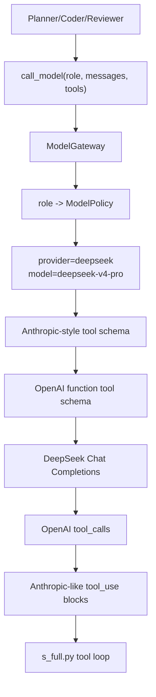

# DeepSeek v4 Pro 接入 ModelGateway 设计

这份文档记录 DeepSeek v4 Pro 如何接入当前 coding-agent harness。

核心结论：

> DeepSeek 不应该由每个 agent 自己读取 API key，而应该作为 `ModelGateway`
> 的一个 provider。Planner/Coder/Reviewer 只声明 role，Gateway 决定 provider、model、
> tool schema、token budget、retry 和调用日志。

## 1. 官方 API 形态

DeepSeek API 兼容 OpenAI/Anthropic 格式。当前接入使用 OpenAI-compatible Chat API：

```text
base_url = https://api.deepseek.com
model = deepseek-v4-pro
cheap model = deepseek-v4-flash
```

推荐环境变量：

```sh
MODEL_PROVIDER=deepseek
DEEPSEEK_API_KEY=...
DEEPSEEK_MODEL_ID=deepseek-v4-pro
DEEPSEEK_CHEAP_MODEL_ID=deepseek-v4-flash
DEEPSEEK_BASE_URL=https://api.deepseek.com
DEEPSEEK_THINKING=enabled
DEEPSEEK_REASONING_EFFORT=high
```

仓库里提供 `.env.example`，只放占位符：

```sh
cp .env.example .env
```

真实 key 只写入本机 `.env`。`.env` 已经在 `.gitignore` 中，不应该提交。

也可以直接运行：

```sh
bash scripts/run_deepseek_agent.sh
```

## 2. 安全边界

不要把 key：

- 写进仓库
- 写进 `.env` 后提交
- 放进 task pack
- 放进 failure digest
- 放进 model call log
- 放进 Docker 输出

正确边界：

```text
shell/env
  -> ModelGateway.from_env()
  -> ProviderCredentials
  -> OpenAI-compatible client
  -> agent role call
```

Agent 本身只知道：

```text
role = coder
model = deepseek-v4-pro
```

Agent 不应该知道 key。

## 3. 数据流



## 4. 为什么要转换 tool schema

当前 `s_full.py` 的工具协议接近 Anthropic：

```json
{
  "name": "read_file",
  "description": "Read file.",
  "input_schema": {
    "type": "object",
    "properties": {
      "path": { "type": "string" }
    }
  }
}
```

OpenAI-compatible Chat API 需要：

```json
{
  "type": "function",
  "function": {
    "name": "read_file",
    "description": "Read file.",
    "parameters": {
      "type": "object",
      "properties": {
        "path": { "type": "string" }
      }
    }
  }
}
```

所以 DeepSeek 接入不只是换 base URL，还要处理工具调用协议。

## 5. 当前实现

修改点：

- `ProviderCredentials` 增加 `deepseek_api_key` / `deepseek_base_url`
- `default_role_policies()` 在存在 `DEEPSEEK_API_KEY` 时默认选择 `provider=deepseek`
- `deepseek` provider 使用 OpenAI SDK 访问 `https://api.deepseek.com`
- DeepSeek 默认强模型为 `deepseek-v4-pro`
- Summarizer 默认便宜模型为 `deepseek-v4-flash`
- Anthropic-style tools 会转换成 OpenAI function tools
- OpenAI `tool_calls` 会转换回 `s_full.py` 能消费的 `tool_use` blocks

## 6. 面试讲法

可以这样说：

> 我没有让每个 agent 自己接 DeepSeek API，而是把 DeepSeek 接到 ModelGateway。
> 这样 Planner/Coder/Reviewer 仍然只按 role 调用模型，provider 差异被 Gateway 隐藏。
> DeepSeek 兼容 OpenAI Chat API，但工具调用 schema 和 Anthropic 不同，
> 所以我在 Gateway 层做了 tool schema 转换和 response normalization。

继续讲安全：

> API key 只从环境变量进入 ProviderCredentials，不进入 task pack、prompt、call log 或 Docker。
> Agent 拿到的是模型能力，不拿凭证。

## 7. 当前限制

- 真实 API 调用需要本地设置 `DEEPSEEK_API_KEY`
- 当前还没有把 DeepSeek token 价格写入默认 cost table
- DeepSeek tool calling 的复杂边界还需要用真实 agent loop 压测
- 多轮 OpenAI tool message 转换已有基础支持，但仍需要用真实项目任务继续验证
