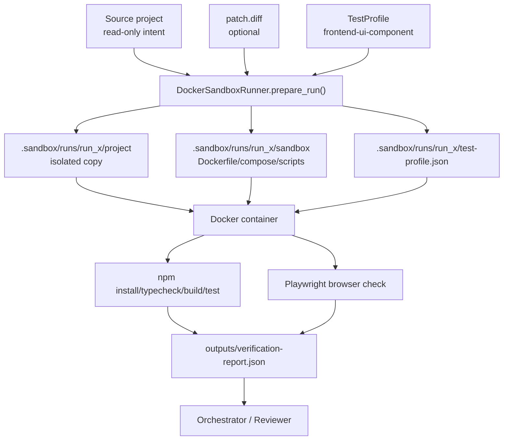

# 第 7 步：Docker Sandbox Runner 设计

这份文档解释第 7 步：为什么要用 Docker/Sandbox 验证复杂任务，为什么这一步直接做
Level 2 Docker 隔离，`TestProfile` 如何描述不同测试场景，数据如何从原项目流向 sandbox，
以及面试时怎么讲清楚技术取舍。

核心结论：

> SandboxRunner 是本地 CI 替代层。Agent 不直接在宿主项目里跑 `npm install/build/dev`，
> 而是创建隔离运行目录，复制项目，应用 patch，按 test profile 在 Docker 容器里验证，
> 最后只把报告、日志、截图和 patch 作为 artifact 交回 Orchestrator。

## 1. 常规设计思路

真实开发里，如果要在一个前端项目中新增 UI 组件，一般流程是：

- 在本地写组件
- 启动项目看 UI 是否正常
- 跑 typecheck/build/test
- 推到 CI/CD
- CI/CD 再跑一遍干净环境验证

但是 coding agent 项目里通常没有完整 CI/CD。最直接的做法是让 agent 直接在宿主项目里跑：

```text
npm install
npm run build
npm run dev
playwright screenshot
```

这个方案很快，但风险大。

## 2. 执行后会碰到的问题

如果让 agent 直接在宿主机/原项目里跑命令，会出现几个问题：

- 可能改乱原项目 `package-lock.json`
- 可能生成庞大的 `node_modules`
- 可能留下 `dist/coverage/.vite` 等运行产物
- 可能占用本地端口
- 失败后留下半成品文件
- 多次尝试会污染后续验证结果
- agent 写错命令时可能影响宿主环境

所以第 7 步的核心不是“会不会 Docker”，而是：

- 原项目只作为 source
- sandbox 运行目录可写
- 验证失败只污染 sandbox
- 通过后才考虑 promote patch

## 3. 技术取舍

### 取舍 1：直接做 Level 2 Docker，而不是先 LocalSandbox

可选方案：

- Level 1：LocalSandbox，只复制目录，在宿主机跑命令
- Level 2：DockerSandbox，复制目录，在容器里跑命令

这一步选择 Level 2，原因：

- 面试里 Docker 隔离更好讲
- 更接近 CI/CD 的干净环境
- 能把 Node/Playwright 环境固定到 image
- 宿主机不需要直接安装项目依赖
- 后续可以扩展到 UDP、后端服务、多容器集成测试

代价：

- Docker 镜像需要下载
- 首次运行慢
- 容器内网络/缓存要额外设计
- 本地没有 Docker 时只能 prepare，不能 run

当前实现把 `prepare_run()` 和 `run()` 分开，就是为了降低这个代价。

### 取舍 2：prepare 和 run 分离

不直接 `prepare + run` 一步完成，而是：

```text
prepare_run()
  -> 生成 .sandbox/runs/<id>/
  -> 写 Dockerfile / compose / run_tests.sh / profile
  -> 允许人工或 reviewer 检查

run()
  -> docker compose run verifier
  -> 写 outputs/sandbox-result.json
```

好处：

- 可以先看 Dockerfile 和 profile 是否合理
- 可以复现同一次 sandbox run
- 可以把 prepare 作为低风险操作暴露给 agent
- 真正执行 Docker 时再走权限/环境检查

### 取舍 3：不用硬编码测试，使用 TestProfile

复杂测试场景不能写死在 Verifier 里。比如：

- 普通前端页面
- UI 组件改动
- UI + API 联调
- Storybook 组件验证
- UDP 协议验证

这些任务需要不同测试步骤，所以设计 `TestProfile`：

```json
{
  "name": "frontend-ui-component",
  "project_type": "frontend",
  "commands": [
    { "name": "install", "command": ["npm", "install"], "required": true },
    { "name": "typecheck", "command": ["npm", "run", "typecheck"], "required": false },
    { "name": "build", "command": ["npm", "run", "build"], "required": true },
    { "name": "test", "command": ["npm", "run", "test"], "required": false }
  ],
  "browser": {
    "enabled": true,
    "check_console_errors": true,
    "screenshots": true
  }
}
```

这比硬编码命令更适合面试回答：

> 不固定测试场景不能靠硬编码测试，而是靠 test profile。不同任务类型映射到不同 profile，
> Verifier/SandboxRunner 根据 profile 创建运行环境。

## 4. 目录结构

目标目录结构：

```text
repo/
  app/
    package.json
    src/

  .sandbox/
    runs/
      run_001/
        project/                 # 原项目隔离副本
        patch.diff               # agent 生成的 patch
        test-profile.json         # 当前测试 profile
        sandbox-run.json          # sandbox manifest
        sandbox/
          Dockerfile
          docker-compose.yml
          run_tests.sh
          browser_check.mjs
          write_report.mjs
        outputs/
          steps.jsonl
          verification-report.json
          screenshot-desktop.png
          screenshot-mobile.png
          sandbox-result.json
```

原项目不直接写入 `node_modules/dist/outputs`。这些都留在 `.sandbox/runs/<id>/project` 或
`.sandbox/runs/<id>/outputs`。

## 5. 数据流向



## 6. 当前实现

新增模块：

- `harness/sandbox_runner.py`

核心类型：

- `TestProfile`
- `TestCommand`
- `BrowserProfile`
- `BrowserViewport`
- `SandboxRun`
- `SandboxExecutionResult`
- `DockerSandboxRunner`

核心方法：

- `frontend_ui_component_profile()`
- `DockerSandboxRunner.prepare_run()`
- `DockerSandboxRunner.run()`
- `DockerSandboxRunner.load_run()`

`s_full.py` 工具入口：

- `prepare_docker_sandbox`
- `run_docker_sandbox`

## 7. 运行过程

### prepare 阶段

```text
prepare_docker_sandbox(project_dir, patch_text)
  -> 复制 project 到 .sandbox/runs/<id>/project
  -> 忽略 node_modules/dist/.git/.context/.logs 等目录
  -> 写 patch.diff
  -> 写 test-profile.json
  -> 写 Dockerfile/docker-compose.yml/run_tests.sh
  -> 写 sandbox-run.json
```

### run 阶段

```text
run_docker_sandbox(run_dir)
  -> docker compose -f sandbox/docker-compose.yml run --rm verifier
  -> 容器内应用 patch
  -> npm install
  -> npm run typecheck
  -> npm run build
  -> npm run test
  -> npm run dev
  -> Playwright 打开页面
  -> 收集 console errors
  -> 截 desktop/mobile screenshot
  -> 写 verification-report.json
```

## 8. UI 组件改动怎么验证

如果目标是“给现有前端项目增加 UI 组件”，sandbox profile 应该验证：

- 类型是否正确
- import/export 是否能通过 build
- 页面是否能打开
- desktop/mobile 是否截图
- console 是否有 error
- 如果有 preview route，则打开 preview route
- 如果没有 preview route，可以后续生成临时 preview 文件，仅存在 sandbox 副本中

这里的重点是：

> UI 组件不是只看代码 diff，要看浏览器里是否真实渲染。

## 9. 面试讲法

可以这样讲：

> 真实开发里，开发者改完 UI 会先本地跑，再交给 CI/CD。我这个项目没有 CI/CD，
> 所以我把 DockerSandboxRunner 设计成本地 CI 替代层。Agent 不直接在原项目里安装依赖
> 或启动服务，而是先创建 `.sandbox/runs/<id>`，复制项目、应用 patch、写入 test profile，
> 再在 Docker 容器里执行 install/typecheck/build/test/Playwright。最后只把 report、日志、
> 截图和 patch 交回 Orchestrator。通过后才允许 promote 到原项目。

一句话总结：

> SandboxRunner 负责隔离环境，Verifier 负责质量判断，TestProfile 负责把任务类型映射到验证流程。

## 10. 面试官可能追问

**为什么不用宿主机直接跑？**

因为 agent 可能改乱依赖、lockfile、dist、端口和缓存。容器隔离能把失败限制在 sandbox 目录。

**为什么还要复制项目，不直接挂载原项目？**

原项目应该是 source of truth。sandbox 中的 `project/` 是可写副本，失败不会污染原项目。

**为什么 Dockerfile 用 Playwright 镜像？**

前端 UI 验证需要浏览器依赖。Playwright 官方镜像已经包含浏览器运行依赖，适合作为前端验证基底。

**为什么 TestProfile 而不是固定命令？**

因为不同任务的验证标准不同。UI 组件、API 联调、UDP 协议、后端服务都应映射到不同 profile。

**如果 Docker 不可用怎么办？**

当前设计允许只执行 `prepare_run()`，生成 sandbox artifacts。真正 `run()` 需要 Docker 环境。
面试时可以说这是环境依赖，不是架构缺口。

## 11. 当前限制

当前 DockerSandboxRunner 还没有实现：

- promote patch 回原项目
- Docker layer/npm cache 优化
- 多服务 docker compose
- API mock server
- Storybook profile
- UDP/network profile

这些可以作为后续扩展。第 7 步先把最重要的边界立住：**不在宿主机乱跑，先隔离验证**。
