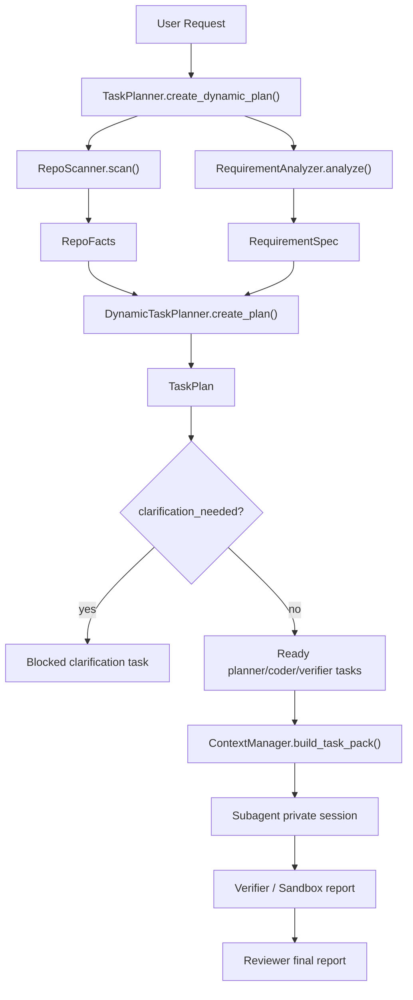

# 动态任务规划设计：从固定 6 步升级到 repo-aware planner

这份文档解释一次真实的架构修正：早期 `TaskPlanner.create_frontend_plan()` 直接返回固定
6 个 task，这能演示“主 agent 先拆任务再执行”，但它不是成熟 coding agent
应该采用的规划方式。成熟做法应该先读取仓库事实、分析用户意图，再按任务类型生成任务图。

当前实现把固定模板降级为 `template_fallback`，新增默认路径：

```text
User Request
  -> RepoScanner
  -> RequirementAnalyzer
  -> DynamicTaskPlanner
  -> TaskPlan
  -> TaskPack
  -> Coder / Verifier / Reviewer
```

## 1. 为什么第一版会做成固定 6 个 task

第一版的目标不是做完整 agent planning，而是先跑通一条最小闭环：

- 用户说“生成一个 React 网页”
- Planner 生成 spec
- Coder 生成完整前端工程
- Verifier 安装、构建、浏览器验证
- Coder 根据失败日志修复
- Reviewer 输出报告

这个模板对“从 0 生成一个 Vite + React 项目”是合理的，因为目标非常固定。
但是它有三个明显问题：

- 它不看仓库结构。CRA、Vite、Next、monorepo、前后端分离项目都会被套成同一条流程。
- 它不处理模糊需求。用户说“优化这个项目”时，agent 不应该直接改代码，而应该先澄清目标。
- 它不随任务类型变化。UI 组件、前后端联调、bugfix、补测试、生成新工程，本来应该是不同任务图。

所以固定 6 步只能作为面试 demo 的 MVP：

```text
MVP: prove the loop exists
production design: make the loop repo-aware and requirement-aware
```

面试讲法：

> 第一版我先用固定 workflow 跑通 verification-first 闭环，证明 agent 不是只吐 React
> 组件文本，而是能生成工程、构建、验证、反馈修复。后来在接入真实 GitHub 项目时发现固定
> 6 步不够，因为真实项目可能是 CRA + Express，不是 Vite。因此我把规划层拆成
> RepoScanner、RequirementAnalyzer、DynamicTaskPlanner，默认根据仓库事实和需求类型动态产出任务图。

## 2. 新设计的三个模块

### RepoScanner：先看事实，不先写代码

文件：`harness/repo_scanner.py`

`RepoScanner` 只做确定性分析，不调用 LLM。它从仓库里提取粗粒度事实：

- `package.json` 列表
- frontend stack：`vite` / `create-react-app` / `next` / `react` / `unknown`
- backend stack：`express` / `fastify` / `python` / `unknown`
- package manager：`npm` / `yarn` / `pnpm` / `unknown`
- 可能的 frontend/backend 目录
- `build`、`test`、`dev/start` 命令
- API proxy
- 相关文件候选
- repo warning，例如“检测到后端但没有 API proxy”

设计取舍：

- 不追求一次性读懂所有业务代码，只产出 planning 所需的基础事实。
- 不用 LLM 做 repo scan，因为框架、脚本、目录结构用规则更稳定、便宜、可测试。
- 相关文件候选是启发式的，后续可以加 code search、AST、ripgrep 搜索来增强。

### RequirementAnalyzer：把自然语言变成结构化需求

文件：`harness/requirement_analyzer.py`

`RequirementAnalyzer` 当前是规则版，但接口按未来 LLM structured output 设计。它输出：

```json
{
  "task_type": "ui_api_integration",
  "target_area": "dashboard",
  "clarification_needed": false,
  "questions": [],
  "assumptions": [],
  "acceptance_criteria": [],
  "constraints": [],
  "risk_level": "medium"
}
```

当前支持的任务类型：

- `generate_frontend_project`
- `ui_api_integration`
- `existing_frontend_change`
- `bugfix`
- `test_work`
- `ambiguous_improvement`
- `general_code_change`

最重要的设计点：如果用户需求太宽，例如“优化这个项目”，它不会强行生成执行任务，而是返回
`clarification_needed=true`。这时 planner 产出一个 blocked task，要求先问清楚。

面试讲法：

> 需求分析层的职责不是证明 LLM 多聪明，而是把“能不能动手”判断清楚。明确任务进入执行图；
> 模糊任务进入澄清图；高风险任务附带约束和验收标准。这样 agent 不会因为用户一句“优化一下”
> 就扩大范围乱改。

### DynamicTaskPlanner：按任务类型生成任务图

文件：`harness/dynamic_task_planner.py`

`DynamicTaskPlanner` 接收 `RequirementSpec + RepoFacts`，输出 `TaskPlan`。

UI + API 联调需求的任务图：

```text
task_001 planner   扫描仓库结构和相关代码路径
task_002 planner   定义 UI 与 API contract
task_003 coder     实现 UI + API 联调改动
task_004 verifier  在 sandbox 中执行 build 和浏览器验证
task_005 reviewer  审查 diff、验证报告和剩余风险
```

已有前端 UI 改动：

```text
task_001 planner   扫描仓库结构和相关代码路径
task_002 coder     实现前端 UI 改动
task_003 verifier  运行匹配项目类型的验证
task_004 reviewer  审查结果并输出最终报告
```

生成新前端工程：

```text
task_001 planner   解析用户自然语言，生成项目规格
task_002 coder     生成完整前端工程
task_003 verifier  安装依赖、构建并验证浏览器打开
task_004 reviewer  输出最终报告
```

模糊需求：

```text
task_001 planner   等待用户澄清需求
status: blocked
result.questions: [...]
```

## 3. 数据流向



关键中间产物：

- `RepoFacts`：仓库事实，不依赖 LLM。
- `RequirementSpec`：用户意图和验收标准。
- `TaskPlan`：主 agent 的任务图。
- `TaskPack`：发给子 agent 的最小上下文包。
- `VerificationReport`：确定性验证结果。
- `FailureDigest`：失败日志结构化摘要。

## 4. Prompt 模式：不是直接暴露 CoT

这个项目后续可以用 LLM 增强 `RequirementAnalyzer`，但 prompt 设计不应该要求模型输出完整
chain-of-thought。更合适的是：

- Plan-and-Execute：先产出可执行任务图，再逐个执行。
- ReAct-style tool loop：agent 在每轮根据观察选择工具，但工具结果进入结构化状态。
- Structured Output：规划输出 JSON schema，例如 `task_type`、`acceptance_criteria`、`dependencies`。
- Reflection/Review：失败后由 verifier/reviewer 给出结构化反馈，再进入下一轮修复。

不建议的设计：

- 让 agent 在一个长 prompt 里“想清楚所有事然后直接写代码”。
- 让每个子 agent 自己拼 prompt、自己拿 API key、自己决定上下文。
- 把完整终端日志和完整聊天历史塞给 coder。

面试讲法：

> Prompt 层不是让模型输出 CoT，而是让模型在受控 schema 里做决策。主循环类似
> ReAct，会根据 repo scan、验证日志、review 结果继续选择工具；但对外持久化的是任务状态、
> 验收标准、失败摘要和最终报告，不保存模型的隐藏推理。

## 5. 和 Hermes/Kanban 思路的关系

Hermes 这类 agent 的关键启发不是“固定几个 worker”，而是：

- agent loop 负责组装 system prompt、压缩上下文、调用模型、解析工具、执行工具、写回结果。
- durable Kanban/task board 负责保存任务、状态、依赖、评论、handoff。
- delegate task 适合短 RPC；Kanban 适合长期任务和多 worker 协作。
- prompt cache 友好的做法是把上下文分层，稳定部分放前面，易变任务状态放后面。

本项目对应关系：

| Hermes-style 概念 | 本项目当前实现 |
| --- | --- |
| agent loop | `agents/s_full.py` |
| model/provider boundary | `harness/model_gateway.py` |
| memory/context layer | `harness/context_manager.py` |
| durable task graph | `harness/task_planner.py` + `.tasks/plans/*.json` |
| repo-aware planning | `harness/repo_scanner.py` + `harness/requirement_analyzer.py` |
| child task handoff | `TaskPack` |
| deterministic verification | `Verifier` + `DockerSandboxRunner` |

这里还没有完整 SQLite Kanban，但已经把任务图、状态、依赖和子 agent 输入结构化了。下一步如果要更像
Hermes，可以把 `.tasks/plans/*.json` 换成 SQLite 表：

- `tasks(id, title, owner, status, priority, created_at, updated_at)`
- `task_dependencies(task_id, depends_on_task_id)`
- `task_comments(task_id, author, body, artifact_refs)`
- `task_artifacts(task_id, kind, path, metadata)`

## 6. 用户没说清楚需求怎么办

错误做法：

```text
用户：优化这个项目
agent：开始重构目录、改样式、改构建配置
```

正确做法：

```text
用户：优化这个项目
RepoScanner：识别项目结构
RequirementAnalyzer：判定 ambiguous_improvement
DynamicTaskPlanner：生成 blocked clarification task
agent：问目标模块、优化类型、是否允许改后端、验收方式
```

返回的 plan 示例：

```json
{
  "plan_id": "clarification_required_plan",
  "metadata": {
    "planner_mode": "clarification_required",
    "task_type": "ambiguous_improvement"
  },
  "tasks": [
    {
      "id": "task_001",
      "owner": "planner",
      "status": "blocked",
      "title": "等待用户澄清需求",
      "result": {
        "questions": [
          "目标页面或模块是哪一个？",
          "你希望优化 UI、性能、代码结构、测试覆盖，还是修复具体 bug？"
        ]
      }
    }
  ]
}
```

这就是状态控制的意义：不是把状态枚举设计得很多，而是让状态能阻止错误执行。

## 7. 现在代码怎么用

默认动态规划：

```python
from harness.task_planner import TaskPlanner

planner = TaskPlanner("/path/to/repo")
plan = planner.create_dynamic_plan("在 Dashboard 增加目标统计摘要组件并接入 /api/goals 接口")
```

保留旧模板：

```python
plan = planner.create_frontend_plan("生成一个可运行 React 网页")
assert plan.metadata["planner_mode"] == "template_fallback"
```

在 `agents/s_full.py` 中调用工具：

```json
{
  "request": "在 Dashboard 增加目标统计摘要组件并接入 /api/goals 接口",
  "project_dir": ".",
  "mode": "dynamic"
}
```

如果要复现旧 6 步模板：

```json
{
  "request": "生成一个可运行 React 网页",
  "mode": "template"
}
```

## 8. 当前验证

新增测试覆盖：

- `tests/test_repo_scanner.py`
- `tests/test_requirement_analyzer.py`
- `tests/test_dynamic_task_planner.py`
- `tests/test_task_planner.py`
- `tests/test_external_project_probe.py`

验证命令：

```sh
python3 -m pytest tests/test_repo_scanner.py tests/test_requirement_analyzer.py tests/test_dynamic_task_planner.py tests/test_task_planner.py tests/test_external_project_probe.py -q
```

## 9. 下一步可扩展点

短期：

- 给 `RepoScanner` 增加 `rg` 搜索，根据用户目标找更多相关文件。
- 给 `RequirementAnalyzer` 加 LLM structured output，但保留规则版 fallback。
- 给 `TaskPlan` 增加 artifact refs，例如 `api_contract.json`、`sandbox-report.json`、`screenshot.png`。

中期：

- 把 `.tasks/plans/*.json` 升级成 SQLite Kanban。
- 让 Planner 不只生成一次任务图，而是在 verifier 失败后局部 replan。
- 给 sandbox browser profile 增加 `start_command`，让 CRA 用 `npm start`，Vite 用 `npm run dev`。

长期：

- 支持多 repo、多 worktree、多 sandbox 并发。
- 对每个 agent role 做独立预算、上下文压缩策略和验证 gate。
- 用 evaluation harness 统计任务成功率、验证通过率、失败类型分布和平均修复轮次。
