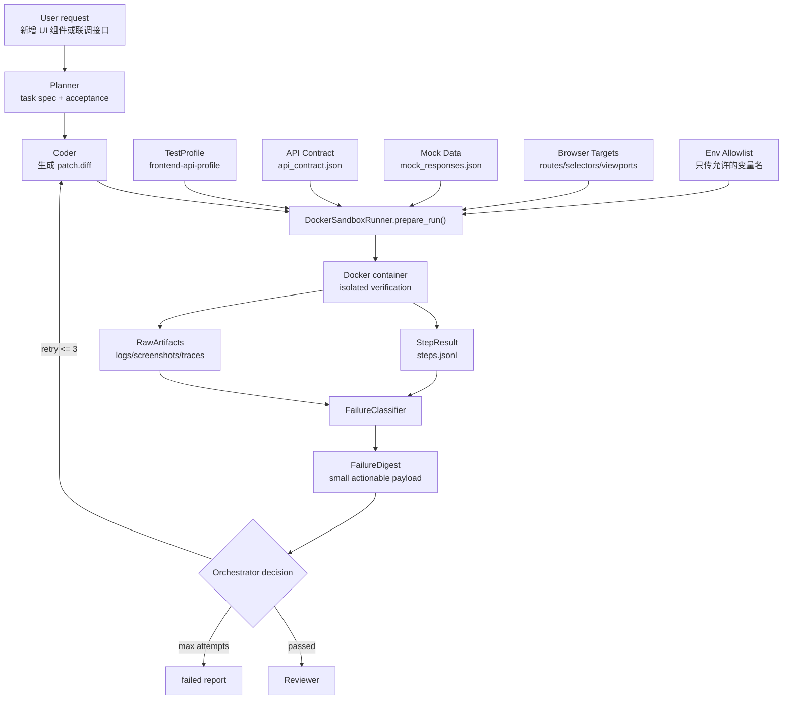

# 第 9 步：失败反馈闭环设计

这份文档解释第 9 步：为什么 UI 组件开发和前后端联调需要结构化失败反馈，
失败日志到底结构化到什么粒度，Docker sandbox 应该接收哪些关键信息，
以及失败信息如何回传给 Coder 进行最多 3 次修复。

核心结论：

> 失败反馈闭环不是把整段日志塞回 LLM，而是把验证过程拆成可追踪的 step，
> 保留完整 raw artifacts，同时生成一个小而准的 `FailureDigest` 给 Coder。
> Docker 接收的也不是自然语言，而是 test profile、patch、API contract、mock 数据、
> browser route、env allowlist 和运行限制。

## 1. 面试官真正想问什么

面试官问“失败日志结构化”时，通常不是只想听：

- 跑失败了
- 把日志给模型
- 模型再修

他真正想确认的是：

- 你怎么避免把 5000 行日志塞回上下文
- 你怎么判断失败类型
- 你怎么知道应该让 Coder 修，还是让 Tester 改测试
- 你怎么处理前端 build error、浏览器 runtime error、API 404、mock contract mismatch
- 你怎么保证 Docker 里拿到足够信息，但又不泄露 API key
- 你怎么让同一次失败可以复现
- 你怎么限制重试次数，避免 agent 无限修

所以第 9 步的重点是：

```text
raw logs 保留
structured digest 回传
retry loop 受控
Docker input 可执行、可复现、可审计
```

## 2. UI 组件 + API 联调是否需要结构化失败日志

需要，但不要过度设计。

如果只是生成一个静态 React 组件，失败来源比较少：

- TypeScript 报错
- build 报错
- 浏览器 console error
- 页面白屏

但是 UI 组件接接口之后，失败来源会变多：

- API base URL 配错
- endpoint 不存在
- mock response 字段和 UI 读取字段不一致
- loading state 没消失
- error state 没展示
- CORS 或网络错误
- 后端返回 200，但 schema 不符合约定
- UI 在移动端布局溢出
- 测试写错，误判业务逻辑

如果只把整段日志扔给 Coder，会有几个问题：

- 日志太长，浪费 token
- 关键信息被淹没
- Coder 可能修错方向
- 多次失败无法比较
- Reviewer 很难判断是否真的修复

所以最低限度需要结构化，但结构化对象要控制在可维护范围。

推荐三层：

- `RawArtifacts`：完整日志、截图、trace、HTML snapshot，留在文件里
- `StepResult`：每个验证步骤的命令、退出码、耗时、日志 tail
- `FailureDigest`：只给 Coder 的关键失败摘要

## 3. 不推荐的做法

不推荐：

```text
失败了 -> 把 stdout/stderr 全部塞回 prompt -> 让模型自己看
```

原因：

- token 成本高
- 大模型会被噪声干扰
- 很多日志是重复 warning
- `npm install` 和 `vite build` 的输出经常包含大量无关信息
- 浏览器 console 可能包含第三方库 warning
- API 联调可能包含敏感 URL 或 token

也不推荐一开始就做特别复杂的 observability 平台：

- 不需要引入 ELK
- 不需要做完整 trace system
- 不需要为每种错误写一个独立 agent
- 不需要把所有日志都转成 AST

当前项目最合适的复杂度是：

```text
Docker/Sandbox 负责产出 artifacts
Verifier 负责按 step 记录结果
FailureClassifier 负责生成 digest
Orchestrator 负责决定 retry / stop / review
Coder 只接收 digest + 相关文件片段
```

## 4. 整体数据流



## 5. 给 Docker 的不是 prompt，而是运行输入

Docker 不应该接收“你帮我验证一下这个 UI 组件”这种自然语言。

Docker 应该接收可执行、可复现的结构化输入：

```json
{
  "run_id": "run_20260622_001",
  "task_id": "task_ui_api_001",
  "project_dir": ".sandbox/runs/run_20260622_001/project",
  "patch": ".sandbox/runs/run_20260622_001/patch.diff",
  "profile": ".sandbox/runs/run_20260622_001/test-profile.json",
  "api_contract": ".sandbox/runs/run_20260622_001/inputs/api_contract.json",
  "mock_data": ".sandbox/runs/run_20260622_001/inputs/mock_responses.json",
  "browser_targets": ".sandbox/runs/run_20260622_001/inputs/browser_targets.json",
  "env_allowlist": ".sandbox/runs/run_20260622_001/inputs/env_allowlist.json",
  "limits": {
    "timeout_seconds": 180,
    "memory": "2g",
    "cpu": "2"
  }
}
```

也就是说，Orchestrator 负责把自然语言需求转成运行材料。

Docker/SandboxRunner 只负责执行这些材料。

## 6. Docker 输入应该包含哪些关键信息

### 6.1 patch

当前 agent 生成的改动：

```text
patch.diff
```

用途：

- 在 sandbox project 副本里应用 patch
- 失败后可以复现同一次改动
- Reviewer 可以看 diff
- 通过后可以决定是否 promote 到真实项目

### 6.2 test profile

验证策略：

```json
{
  "name": "frontend-api-profile",
  "project_type": "frontend",
  "commands": [
    { "name": "install", "command": ["npm", "install"], "required": true },
    { "name": "typecheck", "command": ["npm", "run", "typecheck"], "required": false },
    { "name": "build", "command": ["npm", "run", "build"], "required": true },
    { "name": "test", "command": ["npm", "run", "test"], "required": false }
  ],
  "browser": {
    "enabled": true,
    "routes": ["/", "/preview/new-component"],
    "viewports": [
      { "name": "desktop", "width": 1440, "height": 900 },
      { "name": "mobile", "width": 390, "height": 844 }
    ],
    "check_console_errors": true,
    "screenshots": true
  }
}
```

用途：

- 不同任务选择不同验证方式
- UI-only 和 UI + API 联调用不同 profile
- 避免把测试命令硬编码到 agent prompt 里

### 6.3 API contract

前后端联调时，必须告诉 Docker “接口应该长什么样”。

示例：

```json
{
  "base_url_env": "VITE_API_BASE_URL",
  "endpoints": [
    {
      "name": "listUsers",
      "method": "GET",
      "path": "/api/users",
      "success_status": 200,
      "response_schema": {
        "type": "object",
        "required": ["users"],
        "properties": {
          "users": {
            "type": "array",
            "items": {
              "type": "object",
              "required": ["id", "name"],
              "properties": {
                "id": { "type": "string" },
                "name": { "type": "string" }
              }
            }
          }
        }
      }
    }
  ]
}
```

用途：

- 判断是 UI 代码错，还是接口数据不符合约定
- 让 mock server 生成正确响应
- 让 browser check 验证页面状态

### 6.4 mock responses

真实后端不可用时，用 mock response 覆盖 UI 状态：

```json
{
  "GET /api/users": {
    "status": 200,
    "body": {
      "users": [
        { "id": "u_1", "name": "Ada" }
      ]
    }
  },
  "GET /api/users?mode=empty": {
    "status": 200,
    "body": {
      "users": []
    }
  },
  "GET /api/users?mode=error": {
    "status": 500,
    "body": {
      "message": "server error"
    }
  }
}
```

用途：

- 验证 success state
- 验证 empty state
- 验证 error state
- 避免真实后端不稳定导致 agent 误修 UI

### 6.5 browser targets

告诉浏览器应该打开什么页面、检查什么信号：

```json
{
  "routes": [
    {
      "path": "/preview/new-component",
      "wait_for": "[data-testid='user-list']",
      "must_contain_text": ["Ada"],
      "forbidden_console_levels": ["error"]
    }
  ],
  "screenshots": [
    { "route": "/preview/new-component", "viewport": "desktop" },
    { "route": "/preview/new-component", "viewport": "mobile" }
  ]
}
```

用途：

- 不只验证“页面能打开”
- 还验证关键 DOM 出现
- 检查 console error
- 留截图给 Reviewer 看

### 6.6 env allowlist

不能把所有宿主机环境变量都传给 Docker。

应该传白名单：

```json
{
  "public": {
    "VITE_API_BASE_URL": "http://mock-api:3001"
  },
  "secret_names": [
    "REAL_API_TOKEN"
  ],
  "redact_patterns": [
    "Bearer [A-Za-z0-9._-]+",
    "sk-[A-Za-z0-9._-]+"
  ]
}
```

原则：

- 前端 public env 可以明文进入 sandbox
- secret 只传变量名，不进入 prompt
- 真实 secret 由运行器注入容器，不写进 Git
- 输出日志必须 redact
- 默认用 mock API，不默认打真实外部接口

## 7. Docker 输出应该包含哪些文件

每次 run 输出：

```text
.sandbox/runs/<run_id>/outputs/
  steps.jsonl
  verification-report.json
  failure-digest.json
  raw/
    install.stdout.log
    install.stderr.log
    build.stdout.log
    build.stderr.log
    browser-console.json
    network.json
  screenshots/
    desktop.png
    mobile.png
  traces/
    playwright-trace.zip
```

其中：

- `steps.jsonl` 给机器读
- `verification-report.json` 给 Orchestrator 和 Reviewer 读
- `failure-digest.json` 给 Coder 读
- `raw/*.log` 只在需要时引用，不直接塞进 prompt
- `screenshots/` 给人工和 Reviewer 判断 UI
- `traces/` 用于复杂浏览器问题复现

## 8. StepResult 结构

每个验证步骤写一条记录：

```json
{
  "run_id": "run_20260622_001",
  "step": "build",
  "command": "npm run build",
  "required": true,
  "status": "failed",
  "exit_code": 1,
  "duration_ms": 8421,
  "stdout_ref": "outputs/raw/build.stdout.log",
  "stderr_ref": "outputs/raw/build.stderr.log",
  "stdout_tail": "...",
  "stderr_tail": "src/App.tsx:18:12 - error TS2741: Property 'onClick' is missing...",
  "started_at": "2026-06-22T12:00:00Z",
  "ended_at": "2026-06-22T12:00:08Z"
}
```

这层用于：

- 判断哪个 step 失败
- 保留完整日志引用
- 给 classifier 提取错误类型

## 9. FailureDigest 结构

给 Coder 的不是完整日志，而是：

```json
{
  "run_id": "run_20260622_001",
  "task_id": "task_ui_api_001",
  "attempt": 1,
  "profile": "frontend-api-profile",
  "failed_step": "build",
  "command": "npm run build",
  "exit_code": 1,
  "error_type": "typescript_error",
  "retryable": true,
  "affected_files": [
    {
      "path": "src/App.tsx",
      "line": 18,
      "column": 12
    }
  ],
  "summary": "Button props 缺少必填 onClick，导致 TypeScript build 失败。",
  "evidence": [
    {
      "kind": "stderr_excerpt",
      "text": "src/App.tsx:18:12 - error TS2741: Property 'onClick' is missing..."
    }
  ],
  "raw_refs": [
    "outputs/raw/build.stderr.log"
  ],
  "suggested_next_action": "在 App.tsx 中传入 onClick，或修改 ButtonProps 使该字段可选。",
  "confidence": 0.92
}
```

这个对象要短，因为它会进 Coder 上下文。

推荐控制在：

- 1 个主要失败 step
- 1 到 3 个 affected files
- 1 到 5 条 evidence
- 1 个 suggested next action
- raw refs 只给路径，不贴完整内容

## 10. 失败类型分类

最小分类：

- `dependency_install_error`
- `typescript_error`
- `build_error`
- `unit_test_failure`
- `browser_console_error`
- `browser_render_error`
- `api_connection_error`
- `api_contract_mismatch`
- `timeout`
- `sandbox_infra_error`
- `unknown_error`

分类规则示例：

```text
stderr 包含 "TS" + "error" + 文件行列
  -> typescript_error

browser console 包含 level=error
  -> browser_console_error

network log 中 request failed / ECONNREFUSED
  -> api_connection_error

response body 不符合 api_contract.json
  -> api_contract_mismatch

docker compose 自己失败，项目命令没开始
  -> sandbox_infra_error
```

面试里可以这样讲：

> 第一版不用机器学习分类，先用规则和日志解析就够。因为验证失败大部分来自固定工具链，
> 比如 TypeScript、Vite、Vitest、Playwright、fetch/network。规则分类更稳定，
> 只有 unknown 或 ambiguous 时才交给 Reviewer/Tester agent 分析。

## 11. Coder 应该收到什么

Coder 修复时应该收到：

- 原始 task spec
- 当前 patch 或文件 diff
- `FailureDigest`
- 相关文件片段
- 最多最近 1 到 2 次失败摘要

不应该收到：

- 全量 npm install 日志
- 全量 Docker 输出
- 全量浏览器 trace
- secret
- 所有历史尝试日志

推荐 Coder prompt 输入：

```json
{
  "task": {
    "id": "task_ui_api_001",
    "goal": "新增用户列表组件并接入 /api/users"
  },
  "current_attempt": 2,
  "max_attempts": 3,
  "failure_digest": {
    "failed_step": "browser_check",
    "error_type": "api_contract_mismatch",
    "summary": "页面读取 user.fullName，但 contract 中字段是 user.name。",
    "affected_files": ["src/components/UserList.tsx"],
    "suggested_next_action": "把 fullName 改为 name，或更新 contract。"
  },
  "allowed_actions": [
    "edit_files",
    "request_reverify"
  ]
}
```

## 12. Orchestrator 如何控制重试

状态机不应该让 Coder 自己决定无限重试。

规则：

- 第一次失败：把 `FailureDigest` 给 Coder 修
- 第二次失败：给 Coder 最近两次 digest，让它比较是否同类错误
- 第三次失败：如果还是同类错误，停止自动修复，交给 Reviewer
- 如果失败类型是 `sandbox_infra_error`，不要让 Coder 修业务代码
- 如果失败类型是 `api_connection_error` 且真实后端不可用，切 mock profile 复验
- 如果失败类型从 build error 变成 browser error，说明有进展，可以继续重试

示例：

```text
attempt 1: typescript_error
  -> needs_fix, coder 修类型

attempt 2: browser_console_error
  -> 说明 build 已过，有进展，继续修 runtime

attempt 3: browser_console_error 同一行同一错误
  -> stop, reviewer 判断是不是需求或测试错了
```

## 13. UI + API 联调的特殊处理

### 13.1 默认先 mock，不直接打真实后端

真实接口可能：

- 没启动
- 需要 VPN
- 需要登录态
- 数据不稳定
- 写操作有副作用

所以默认策略：

```text
mock API 验证 UI 状态
real API 只做 smoke test
```

即：

- mock 验证组件是否正确处理 loading/success/empty/error
- real API 只验证连通性和 contract
- 如果 real API 不可用，不直接判定 UI 代码失败

### 13.2 API contract 是边界

前后端联调最容易扯不清的是：

```text
是前端字段写错，还是后端返回错？
```

所以必须有 contract：

- contract 说字段叫 `name`
- UI 读取 `fullName`
- mock response 有 `name`
- 页面报 `undefined`
- 这就是 UI bug

如果真实接口返回 `fullName`，而 contract 说 `name`：

- 这不是 Coder 直接改 UI 的充分理由
- 应该进入 `open_issues`
- Reviewer 决定是更新 contract 还是适配真实接口

### 13.3 浏览器验证不能只看页面打开

UI + API profile 至少检查：

- 页面没有 console error
- API request 没有 4xx/5xx
- 指定 selector 出现
- 指定文案出现
- loading state 能结束
- error state 能展示
- mobile viewport 不发生明显溢出

## 14. 和 Docker Sandbox 的关系

Docker 负责“执行”和“采集”。

FailureFeedback 负责“归纳”和“决策输入”。

边界如下：

```text
DockerSandboxRunner:
  - copy project
  - apply patch
  - run commands
  - run browser check
  - collect raw logs
  - write step results

FailureClassifier:
  - read step results
  - inspect error snippets
  - classify error type
  - produce FailureDigest

Orchestrator:
  - decide retry / stop / review
  - choose next owner
  - enforce max_attempts

Coder:
  - only sees digest + relevant context
  - edits code
```

这也是面试里最重要的边界：

> Docker 不做智能决策，LLM 不直接吃原始日志，Orchestrator 不写代码。
> 每层职责很窄，所以系统可控。

## 15. 成功输出结构

验证成功时也要有结构化输出：

```json
{
  "run_id": "run_20260622_001",
  "status": "passed",
  "profile": "frontend-api-profile",
  "steps": [
    { "name": "install", "status": "passed" },
    { "name": "typecheck", "status": "passed" },
    { "name": "build", "status": "passed" },
    { "name": "browser_check", "status": "passed" }
  ],
  "browser": {
    "console_errors": [],
    "screenshots": [
      "outputs/screenshots/desktop.png",
      "outputs/screenshots/mobile.png"
    ]
  },
  "api": {
    "mode": "mock",
    "contract": "passed",
    "real_api_smoke": "not_run"
  }
}
```

成功时交给 Reviewer 的信息：

- diff summary
- verification report
- screenshots
- API mode
- 未验证项

## 16. 当前项目下一步怎么落地

建议拆成两个小模块，而不是把所有逻辑塞进 `sandbox_runner.py`：

```text
harness/
  sandbox_runner.py      # 已有：准备和执行 Docker sandbox
  failure_feedback.py    # 下一步：StepResult / FailureDigest / 分类器
  workflow_state.py      # 下一步：retry loop 和状态流转
```

第一版 `failure_feedback.py` 做这些就够：

- 定义 `StepResult`
- 定义 `FailureDigest`
- 从 `verification-report.json` 和 `steps.jsonl` 读取失败
- 用规则分类错误
- 截断日志 tail
- 生成 `failure-digest.json`

先不做：

- 复杂 ML 分类
- 在线日志系统
- 全量 trace 分析
- 自动定位所有相关文件

## 17. 面试讲法

可以这样说：

> 一开始我也想过把完整日志直接给 Coder，但很快发现前端联调日志噪声很大，
> npm、Vite、Playwright、浏览器 console、network 都会混在一起。
> 所以我把验证输出分成三层：raw artifacts 保留完整证据，step result 记录每一步命令结果，
> failure digest 只给 Coder 关键失败摘要。Docker 侧只接收可执行配置，
> 比如 test profile、patch、API contract、mock response、browser target 和 env allowlist。
> 这样既能复现失败，又不会把上下文撑爆，也不会把 secret 泄露给模型。

继续讲：

> 对 UI + API 联调，我默认先用 mock API 验证 UI 的 loading/success/empty/error 状态，
> 真实 API 只做 smoke test。因为真实后端不稳定时，不能让 agent 误判成 UI 代码错误。
> 如果 mock 通过但 real API 失败，我会把它放进 open issues 或 reviewer 阶段，
> 而不是让 Coder 盲目改代码。

最后讲闭环：

> 修复循环由 Orchestrator 控制，最多 3 次。每次失败都生成 FailureDigest。
> 如果错误类型变化，比如从 TypeScript error 变成 browser error，说明有进展，可以继续。
> 如果同一个错误连续出现，就停止自动修复，交给 Reviewer 判断是需求、测试还是代码问题。

## 18. 面试官可能追问

### Q1：为什么不直接把日志给大模型？

因为日志太长且噪声大。完整日志保存在 raw artifacts，只把 digest 给模型。这样节省 token，
也能降低模型被无关 warning 干扰的概率。

### Q2：结构化失败日志是不是过度设计？

如果只是静态组件，可以很轻。但 UI + API 联调至少要区分 build、browser、network、contract。
否则 Coder 很容易把接口不可用误修成 UI 逻辑。

### Q3：Docker 里怎么知道要测哪个页面？

由 `browser_targets.json` 或 test profile 指定 route、viewport、selector、期望文案和 console policy。
Docker 不猜页面，Orchestrator 明确告诉它。

### Q4：真实 API 的 key 怎么处理？

默认不进 prompt，不进 Git，不进日志。Docker 只通过 env allowlist 注入必要变量，
输出前做 redact。第一版默认 mock，真实 API 只做可选 smoke test。

### Q5：怎么判断失败要不要重试？

看 `error_type` 和 `retryable`。TypeScript、build、browser runtime 通常可重试；
Docker image pull failure、权限问题、后端不可用不应该让 Coder 修业务代码。

### Q6：如果失败是测试写错了怎么办？

Reviewer 阶段判断。Orchestrator 不让 Coder 无限改业务代码。连续同类失败或 reviewer 发现验收标准有问题，
就更新 test profile 或 task spec，而不是继续盲修。

## 19. 这一步的交付标准

第 9 步实现完成时，至少应该具备：

- sandbox 每个 command 都有 `StepResult`
- 失败时生成 `failure-digest.json`
- digest 里包含 `error_type / failed_step / affected_files / summary / raw_refs`
- Orchestrator 只把 digest 给 Coder
- retry 次数最多 3 次
- Docker 输入通过 manifest/profile/contract/mock/env allowlist 表达
- secret 不进入 prompt 和日志

这就是面试里可以说清楚的失败反馈闭环。
