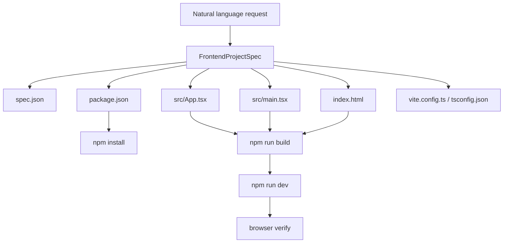

# 第 5 步：生成完整前端工程设计

这份文档解释第 5 步：为什么不能只生成 React 组件，如何从自然语言生成完整
Vite/React/TypeScript 工程，最低交付标准是什么，当前实现解决了什么问题，以及面试时怎么讲。

核心结论：

> coding agent 的交付物不应该是一段组件代码，而应该是一个可以安装、构建、启动、验证的
> 前端工程目录。

## 1. 常规设计思路

最容易想到的方案是让 LLM 直接输出一个 React 组件：

```tsx
export default function App() {
  return <div>Hello</div>;
}
```

这个方案在聊天窗口里看起来很快，但面试官会觉得浅，因为 DeepSeek、Claude、ChatGPT 都能
直接生成一个组件。真正的 coding agent 应该处理工程交付链路：

```text
natural language
  -> spec.json
  -> create Vite project files
  -> package.json
  -> install dependencies
  -> npm run build
  -> npm run dev
  -> browser verify
  -> output URL / dist
```

第 5 步先实现到“完整工程生成 + 最低交付校验”，为后续 sandbox/build/browser verifier
铺路。

## 2. 执行后碰到的问题

只生成组件会遇到几个问题：

- 没有 `package.json`，不知道依赖和 scripts
- 没有 `src/main.tsx`，组件没有挂载入口
- 没有 `index.html`，Vite 无法直接启动
- 没有工程结构，后续 build/browser verify 无法执行
- 用户需求没有落成 `spec.json`，后续修复和报告没有稳定输入
- 面试时很难证明“这个 agent 能交付可运行网页”

所以这一步的重点不是让 UI 多漂亮，而是把产物从“代码片段”升级成“工程目录”。

## 3. 解决方案

新增 `harness/frontend_generator.py`。

它做三件事：

1. `spec_from_natural_language()`：把自然语言转成 `FrontendProjectSpec`
2. `generate_project()`：写出完整 Vite/React/TS 工程文件
3. `validate_minimum_delivery()`：检查最低交付标准

核心数据结构：

```python
FrontendProjectSpec(
    name="generated-frontend",
    title="用户需求标题",
    description="原始自然语言需求",
    features=[...],
    stack={
        "framework": "React",
        "language": "TypeScript",
        "bundler": "Vite",
    },
)
```

生成结果：

```python
GeneratedFrontendProject(
    project_dir="generated/frontend-app",
    spec_path="generated/frontend-app/spec.json",
    files=[
        "package.json",
        "index.html",
        "src/App.tsx",
        "src/main.tsx",
        "src/styles.css",
        "vite.config.ts",
        "tsconfig.json",
        "spec.json",
    ],
)
```

## 4. 最低交付标准

当前第 5 步检查这些最低标准：

| 标准 | 文件/命令 | 当前状态 |
| --- | --- | --- |
| 有 package manifest | `package.json` | 已生成 |
| 有 React 页面入口 | `src/App.tsx` | 已生成 |
| 有 React mount 入口 | `src/main.tsx` | 已生成 |
| 有 HTML 入口 | `index.html` | 已生成 |
| 能安装依赖 | `npm install` | 生成命令和依赖 |
| 能构建 | `npm run build` | 生成 build script |
| 能打开网页 | `npm run dev` | 生成 dev script |

注意：这一步没有真正联网执行 `npm install`，因为当前执行环境网络受限。它生成的是可安装、
可构建的标准 Vite 工程，并用测试校验文件和 scripts 齐全。真正执行安装、构建、浏览器打开
会在后续 `SandboxRunner` / `Verifier` 步骤里做。

## 5. 数据流



`s_full.py` 里现在有两个工具入口：

- `plan_frontend_tasks`
- `generate_frontend_project`

主 agent 应该先调用 `plan_frontend_tasks`，再调用 `generate_frontend_project`。

## 6. 和第 4 步的关系

第 4 步只拆任务，不写代码。

第 5 步消费任务图里的前两步：

```text
task_001: 解析用户自然语言，生成项目规格
task_002: 生成完整前端工程
```

当前 `FrontendGenerator` 把这两个动作合到一个确定性工具里：自然语言输入后，同时写出
`spec.json` 和完整工程文件。后续如果要更像生产 agent，可以拆成两个工具：

- `write_frontend_spec`
- `generate_project_from_spec`

现在先做成一个工具，是为了更快把最低交付链路跑通。

## 7. 解决效果

这一步完成后，项目能力从：

```text
生成一个 React 组件
```

升级成：

```text
生成一个完整 Vite/React/TypeScript 工程目录
```

生成目录包含：

```text
generated/frontend-app/
  spec.json
  package.json
  index.html
  vite.config.ts
  tsconfig.json
  src/
    App.tsx
    main.tsx
    styles.css
```

后续 Verifier 可以直接进入目录执行：

```sh
npm install
npm run build
npm run dev -- --host 127.0.0.1
```

## 8. 面试讲法

可以这样讲：

> 原来如果只是让模型输出一个 React 组件，这和普通聊天模型差不多，不能体现 coding agent
> 的工程能力。所以我把产物升级成完整前端工程。流程是自然语言先变成 spec.json，
> 然后根据 spec 生成 Vite/React/TypeScript 项目，包括 package.json、index.html、
> src/main.tsx、src/App.tsx、样式和配置文件。最低标准是能安装依赖、能 npm run build、
> 能 npm run dev 给浏览器验证。

一句话总结：

> 第 5 步的重点是把“代码片段生成”升级成“工程级交付物生成”。

## 9. 面试官可能追问

**为什么选择 Vite？**

Vite 项目结构简单、启动快、React/TS 支持成熟，适合作为 agent 生成前端工程的最小标准。
面试项目里先用 Vite 可以把重点放在生成、构建和验证链路，而不是复杂脚手架。

**为什么现在的 spec_from_natural_language 是确定性解析，不是 LLM？**

这一步先把工程生成链路做稳定。真正生产里可以让 planner 用强模型生成 spec，再交给
deterministic generator 写文件。面试项目里先做 deterministic generator，测试更稳定，
也更容易证明最低交付标准。

**为什么没有现在就跑 npm install？**

当前环境网络受限，而且 install/build/browser verify 应该属于 sandbox/verifier 的职责。
第 5 步负责生成可执行工程，第 6 步以后负责隔离执行命令和浏览器验证。

**如果用户要 Tailwind、路由、图表怎么办？**

可以扩展 `FrontendProjectSpec`，增加 dependencies、routes、components、design_tokens 字段。
`FrontendGenerator` 根据 spec 选择模板和依赖。现在先交付最小 Vite/React/TS 工程。

## 10. 当前限制

这一步还不是完整产品级前端生成器：

- 没有真实浏览器截图验证
- 没有自动安装依赖
- 没有从 LLM JSON spec 精细生成多页面
- 没有自动修复 build/browser 失败

但它已经解决面试官指出的核心浅层问题：不再只生成组件，而是生成一个可以进入验证链路的
完整前端工程。
