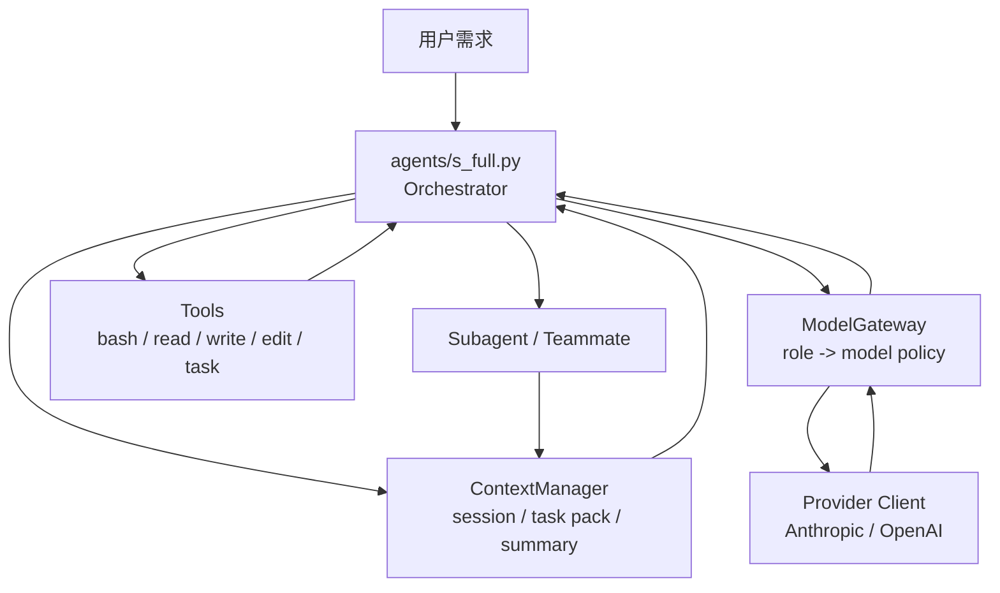
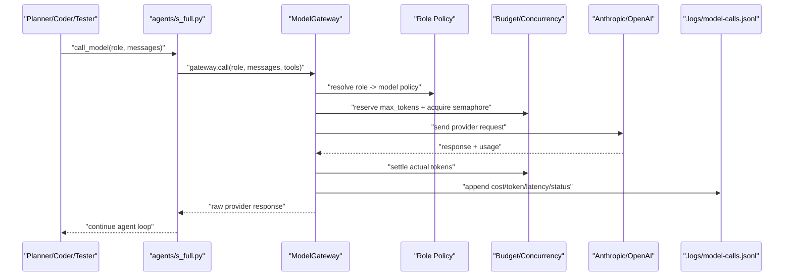
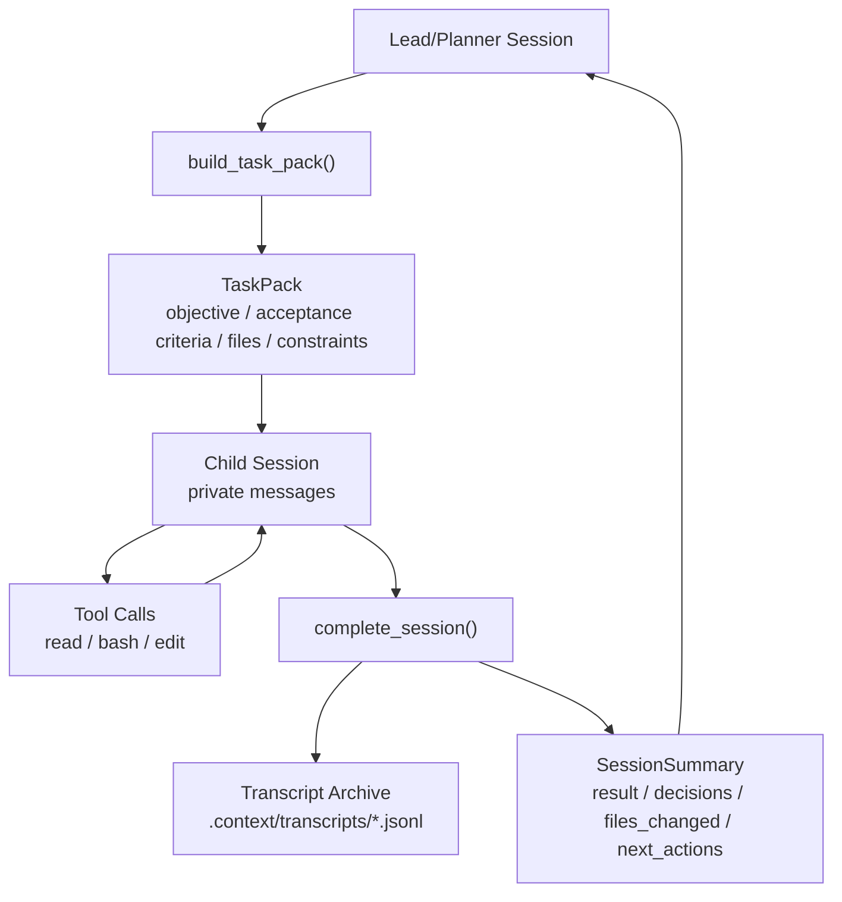
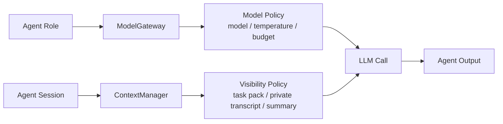

# ModelGateway + ContextManager 数据流

这份文档用于解释前两步重构：为什么要加 `ModelGateway` 和
`ContextManager`，数据如何流动，以及面试时应该怎么讲。

核心回答可以先压缩成一句话：

> `agents/s_full.py` 只做 orchestration，`ModelGateway` 统一管理模型调用，
> `ContextManager` 统一管理多 agent 上下文边界。

## 总体架构

原始项目的问题是：主 agent、子 agent、team agent 都可能直接拿模型 client，
上下文也混在各自的 `messages` 里。这样一旦扩展到 Planner / Coder /
Tester / Reviewer，就会出现三个问题：

- API key、模型选择、重试、预算分散在不同 agent 里
- 子 agent 继承太多父上下文，token 消耗不可控
- 子 agent 的中间过程要么丢失，要么完整塞回父 agent，污染主上下文

现在拆成两个运行时边界：



面试里不要把它说成“我写了两个工具类”。更好的说法是：

> 我把 coding agent 拆成控制面和执行面。`s_full.py` 是控制面，
> 负责调度；模型调用和上下文管理是执行面的基础设施，分别由
> `ModelGateway` 和 `ContextManager` 管。

## 第一步：ModelGateway 数据流

`ModelGateway` 解决的问题是：多 agent 不应该各自读取 API key，也不应该各自决定
用哪个模型、重试几次、花多少 token。

现在所有模型调用都走同一个入口：

```python
call_model("coder", messages, system=..., tools=...)
```

内部数据流如下：



这个设计让角色分配变成配置，而不是散落在代码里的 if/else：

| Role | 模型策略 | 说明 |
| --- | --- | --- |
| `planner` | 强模型、低温度 | 拆任务、做主控决策 |
| `coder` | 强模型 | 写代码，承担主要实现 |
| `tester` | 中等模型 | 生成测试、分析验证结果 |
| `reviewer` | 强模型 | 看 diff、风险、遗漏测试 |
| `summarizer` | 便宜模型 | 压缩上下文 |
| `verifier` | 默认不走 LLM | 依赖命令、浏览器、Docker 等确定性检查 |

面试讲法：

> 我没有让每个 agent 自己拿 API key，而是做了一个模型网关。
> Agent 只声明自己的 role，例如 coder 或 reviewer。网关根据 role 选择模型，
> 同时统一做并发控制、token budget、失败重试和调用审计。这样后面要换模型、
> 降成本、限流或者看账单，不需要改每个 agent。

## 第二步：ContextManager 数据流

`ContextManager` 解决的问题是：多 agent 之间不能简单共享完整 `messages`。

正确的数据形态应该是：

```text
父 agent -> TaskPack -> 子 agent 私有 session -> SessionSummary -> 父 agent
```

也就是说，父 agent 发给子 agent 的不是全部聊天记录，而是一个压缩后的任务包。
子 agent 完整工作过程会归档，父 agent 只收到结果摘要。



在 `s_full.py` 里的接入点：

- 主 loop 创建 lead session
- 用户输入、assistant 输出、tool result 写入 lead session
- `task` 工具创建 child session
- teammate 创建独立 child session
- child 完成后归档 transcript，并把 summary 写回 parent
- compact 时把完整历史归档，只保留 summary + recent messages

面试讲法：

> 我把上下文从“一个不断增长的 messages 数组”改成 session 模型。
> 每个 agent 都有自己的 session。父 agent 给子 agent 的是 TaskPack，
> 里面只有目标、验收标准、相关文件和约束。子 agent 的完整 transcript 归档，
> 父 agent 只接收结构化 SessionSummary。这样既能控制 token，又能保留可审计性。

## 两个模块如何配合

`ModelGateway` 管“谁能调用什么模型、花多少钱”，`ContextManager` 管“谁能看到什么上下文”。



这两个边界合起来，回答的是 coding agent 里非常核心的两个工程问题：

- API 怎么分配：role-based model policy
- 上下文怎么管理：session isolation + summary handoff

## 用到的设计模式

这些模式不一定是前端入门里最常见的，但在后端基础设施和 agent runtime 里很常见。

| 模式 | 在项目里的对应 | 解决的问题 |
| --- | --- | --- |
| Gateway / Facade | `ModelGateway` | 对外暴露统一模型调用入口，隐藏 provider 差异 |
| Strategy / Policy | role -> `ModelPolicy` | 不同 agent 用不同模型、温度、预算 |
| Adapter | Anthropic / OpenAI client 包装 | 让不同 provider 适配同一调用语义 |
| Semaphore / Bulkhead | 并发控制 | 防止多个 agent 同时打爆 API |
| Retry with Backoff | 429 / timeout 重试 | 处理临时限流和网络抖动 |
| Session / Unit of Work | `AgentSessionState` | 每个 agent 的上下文独立保存 |
| Event Log / Audit Log | `.logs/*.jsonl`、`.context/transcripts/*.jsonl` | 方便复盘、审计、调试 |
| Message Passing | `TaskPack`、`SessionSummary` | 父子 agent 通过结构化消息协作 |
| Orchestrator | `agents/s_full.py` | 主控只负责任务流转，不承担所有细节 |

如果面试官追问“为什么不用一个大 prompt 搞定”，可以这样回答：

> 一个大 prompt 在 demo 里可以，但工程上不可控。多 agent 需要控制成本、
> 上下文可见性、失败恢复和审计。Gateway 和 ContextManager 是把这些隐性问题
> 显式建模，否则功能越加越会失控。

## 2 分钟面试讲稿

可以按这个顺序讲：

1. 原项目的问题是所有逻辑都堆在 full agent，模型调用和上下文没有边界。
2. 我先抽了 `ModelGateway`，所有 agent 只传 role，不直接拿 API key。
3. Gateway 根据 role 选择模型，并统一做并发、预算、重试和成本日志。
4. 然后抽了 `ContextManager`，每个 agent 有独立 session。
5. 父 agent 派发任务时发 `TaskPack`，子 agent 完成后只回传 `SessionSummary`。
6. 完整 transcript 会落盘，所以既省 token，又能复盘。
7. 这两个模块给后面的 frontend generator、sandbox runner、verifier 提供稳定边界。

最后落到一句总结：

> 这次重构不是为了多写代码，而是把 coding agent 最容易失控的两个地方先收住：
> 模型调用收敛到 ModelGateway，上下文流转收敛到 ContextManager。

## 代码入口

- `agents/s_full.py`：主 orchestrator，负责 agent loop 和工具调度
- `harness/model_gateway.py`：模型调用网关
- `harness/context_manager.py`：多 agent 上下文管理
- `tests/test_model_gateway.py`：模型网关测试
- `tests/test_context_manager.py`：上下文管理测试
- `tests/test_s_full_background.py`：`s_full.py` 接入测试

## 下一步扩展

前两步完成后，下一步应该是 `FrontendGenerator`：

```text
自然语言需求
  -> FrontendGenerator 生成完整 Vite/React 工程
  -> SandboxRunner 安装依赖、构建、启动
  -> Verifier 做 typecheck/build/Playwright/browser 检查
  -> Reviewer 看验证报告和 diff
```

这条链路接上以后，项目就能从“生成 React 组件”升级到“生成、运行、验证完整前端工程”。
