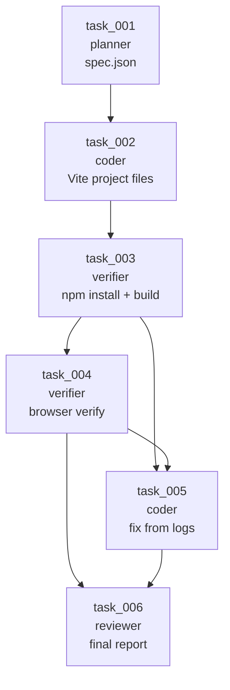
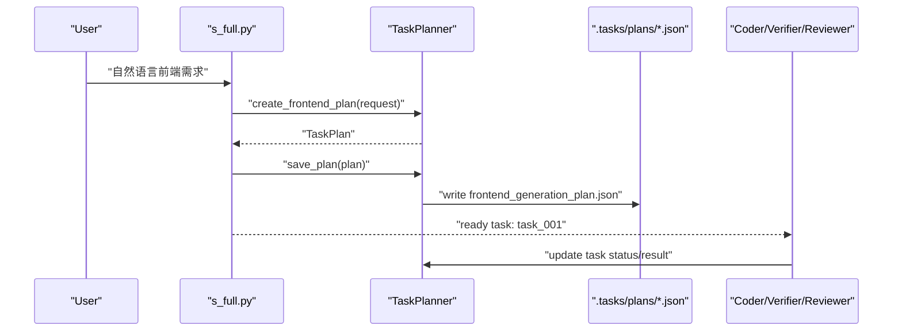
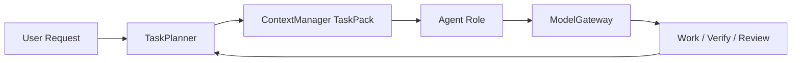

# 第 4 步：任务拆分设计

> 更新说明：本文描述的是第一版固定 frontend-generation workflow，用来解释
> `TaskPlan`、依赖、状态流转这些基础概念。真实项目里的默认规划路径已经升级为
> repo-aware dynamic planner，见 [动态任务规划设计](dynamic-task-planning-zh.md)。

这份文档解释第 4 步：为什么主 agent 先不写代码，而是先拆任务；如何把“生成一个
前端网页”拆成可追踪的任务图；任务状态、依赖和上下文引用如何设计；以及面试时怎么讲。

核心结论：

> 主 agent 不应该一上来就写代码。它应该先把用户需求拆成结构化任务图，
> 明确每个任务的 owner、status、depends_on、context_refs 和 result。
> 这样后续 Coder、Verifier、Reviewer 才有稳定协作边界。

## 1. 常规设计思路

最直接的 coding agent 做法是：用户说“做一个 React 页面”，主 agent 立刻开始写
`App.tsx`。这在 demo 里很快，但它有一个明显问题：agent 会把“规划、实现、验证、修复、
报告”混成一团。

常规的第一版可能是：

```text
user request
  -> LLM 直接生成代码
  -> 写文件
  -> 尝试运行
  -> 遇到失败再临时修
```

这个流程的问题是没有可追踪任务状态。代码写到一半失败了，很难知道：

- 当前到底在第几步
- 哪个 agent 应该负责
- 哪些上下文产物要传给下一步
- 哪一步失败导致后续阻塞

所以第 4 步把“任务拆分”单独抽出来。

## 2. 执行后碰到的问题

如果只用普通 todo list，也会有问题。普通 todo 通常只有：

```json
{
  "content": "生成前端工程",
  "status": "in_progress"
}
```

但 coding agent 的任务需要更多字段：

- `owner`：这一步是 planner、coder、verifier 还是 reviewer 负责
- `depends_on`：任务之间有依赖，不能跳步执行
- `context_refs`：下一步需要哪些文件或报告作为上下文
- `result`：任务完成后要留下结构化结果
- `acceptance_criteria`：任务完成标准要明确

如果没有这些字段，主 agent 很容易越权：还没生成 spec 就开始写代码；还没 build 就开始
浏览器验证；验证失败后不知道要把哪段日志交给 coder 修。

## 3. 解决方案

新增 `harness/task_planner.py`，专门负责结构化任务图。

核心数据结构是：

```python
AgentTask(
    id="task_001",
    owner="planner",
    status="pending",
    title="解析用户自然语言，生成项目规格",
    depends_on=[],
    context_refs=[],
    result=None,
)
```

任务计划是：

```python
TaskPlan(
    goal="用户要生成一个可运行 React 网页",
    tasks=[...],
)
```

第 4 步的标准任务链固定为 6 个任务：

| Task | Owner | 说明 | 依赖 |
| --- | --- | --- | --- |
| `task_001` | `planner` | 解析自然语言，生成 `spec.json` | 无 |
| `task_002` | `coder` | 根据 `spec.json` 生成完整前端工程 | `task_001` |
| `task_003` | `verifier` | 安装依赖并构建 | `task_002` |
| `task_004` | `verifier` | 浏览器打开页面验证 | `task_003` |
| `task_005` | `coder` | 根据失败日志修复 | `task_003`, `task_004` |
| `task_006` | `reviewer` | 输出最终报告 | `task_004`, `task_005` |

任务图：



## 4. 状态流转

任务状态使用固定集合：

```text
pending -> in_progress -> completed
pending -> blocked
in_progress -> failed
failed -> in_progress
```

当前代码里支持：

- `pending`
- `in_progress`
- `completed`
- `failed`
- `blocked`

`TaskPlanner.update_task()` 会检查依赖。如果某个任务的 `depends_on` 还没完成，就不能进入
`in_progress`。

这让主 agent 不能跳过规划直接写代码：

```text
task_002 depends_on task_001
task_001 not completed
=> task_002 cannot become in_progress
```

## 5. 数据流



## 6. 和前几步的关系

- 第 1 步 `ModelGateway` 决定哪个 role 用哪个模型
- 第 2 步 `ContextManager` 决定每个 agent 能看到什么上下文
- 第 3 步上下文压缩决定长任务如何保留状态
- 第 4 步 `TaskPlanner` 决定主 agent 下一步应该派发什么任务

也就是说，第 4 步不是替代前几步，而是把“任务执行顺序”显式建模。



## 7. 解决效果

这一步完成后，项目不再是“LLM 想到哪写到哪”，而是有一个清晰的任务状态机：

- 主 agent 先拆任务，不直接写代码
- 每个任务有 owner，方便派给不同 agent
- 每个任务有 depends_on，避免乱序执行
- 每个任务有 context_refs，明确下一步需要哪些上下文
- 每个任务有 result，方便后续报告和修复
- 任务计划会写入 `.tasks/plans/frontend_generation_plan.json`

## 8. 面试讲法

可以这样讲：

> 我一开始也可以让主 agent 直接生成代码，但这样很难扩展到验证和修复。
> 所以我先把前端生成流程拆成 6 个结构化任务：生成 spec、生成工程、安装构建、
> 浏览器验证、根据失败日志修复、输出最终报告。每个任务都有 owner、状态、
> 依赖、上下文引用和结果。这样主 agent 负责 orchestration，不直接写代码；
> coder、verifier、reviewer 各自处理对应任务。

一句话总结：

> 第 4 步的重点是把“LLM 直接写代码”变成“主 agent 先产出可执行任务图”。

## 9. 面试官可能追问

**为什么不用普通 todo list？**

普通 todo 只能表达“要做什么”和“做没做完”。coding agent 还需要表达 owner、依赖、
上下文引用和结果。否则多 agent 协作时不知道谁负责，也不知道下一步依赖什么。

**为什么 task_005 同时依赖 build 和 browser verify？**

修复任务应该基于失败日志。如果 build 或 browser verify 没跑，就没有可靠失败信息。
所以它依赖 `task_003` 和 `task_004`。

**为什么主 agent 不直接写代码？**

主 agent 如果又规划又写代码，很容易把上下文和职责混在一起。让主 agent 先拆任务，
后续再派给 coder/verifier/reviewer，更容易控制质量、成本和失败恢复。

**如果某一步失败怎么办？**

任务状态可以进入 `failed`，失败日志放进 `result` 或 `context_refs`，然后让修复任务消费
这些引用。后续可以扩展成自动重试和失败分支。

## 10. 当前限制

这一步目前实现的是固定前端工作流模板，还不是通用任务规划器。这样做是刻意的：

- 先把面试问题里的前端生成链路跑通
- 避免一开始做过度抽象
- 后续可以把 `create_frontend_plan()` 泛化成不同 workflow 模板

下一步第 5 步会消费这个任务图，把 `task_001` 和 `task_002` 真的落到完整工程生成。
