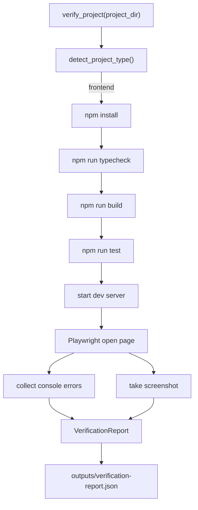

# 第 6 步：验证代码质量设计

这份文档解释第 6 步：为什么 coding agent 不能只生成代码，还必须验证代码质量；
`Verifier` 如何按项目类型自动选择验证命令；前端项目如何执行 install/typecheck/build/test/browser；
最终报告如何输出；以及面试时应该怎么讲。

核心结论：

> Verifier 是 coding agent 从“生成代码”走向“交付可运行结果”的关键边界。
> Coder 负责写代码，Verifier 尽量不靠 LLM，而是靠确定性命令、浏览器、console error 和截图报告判断质量。

## 1. 常规设计思路

最常见的第一版 coding agent 是：

```text
用户需求 -> LLM 生成代码 -> 直接告诉用户完成
```

这个方案最大的问题是：agent 自己说“完成”不等于代码真的能运行。尤其是前端项目，
可能出现很多只有运行时才暴露的问题：

- 依赖没装上
- TypeScript 类型错误
- build 失败
- test 失败
- 页面白屏
- 浏览器 console 有错误
- 页面虽然能打开，但关键内容没渲染

所以第 6 步加 `Verifier`，让代码质量判断从“模型主观判断”变成“命令和浏览器验证”。

## 2. 执行后碰到的问题

直接在 agent loop 里手写验证命令，会遇到几个问题：

- 不同项目类型验证命令不同
- 前端项目需要 npm、build、browser，多步依赖明显
- 命令输出很长，不能直接全塞回上下文
- 浏览器验证需要截图和 console error，不只是命令返回码
- 本地/CI/沙箱环境不同，命令执行方式要可替换
- 网络受限时不能假装 `npm install` 通过

所以 Verifier 不能只是一个 `run_bash("npm run build")`。它需要一个结构化报告模型。

## 3. 解决方案

新增 `harness/verifier.py`。

核心数据结构：

```python
CommandResult(
    name="build",
    command=["npm", "run", "build"],
    status="passed",
    returncode=0,
    stdout="...",
    stderr="...",
)
```

```python
BrowserResult(
    status="passed",
    url="http://127.0.0.1:5173",
    console_errors=[],
    screenshot="outputs/screenshot.png",
)
```

```python
VerificationReport(
    project_type="frontend",
    build="passed",
    tests="passed",
    browser="passed",
    console_errors=[],
    screenshot="outputs/screenshot.png",
)
```

最终 summary 形态和你要求的一致：

```json
{
  "build": "passed",
  "tests": "passed",
  "browser": "passed",
  "console_errors": [],
  "screenshot": "outputs/screenshot.png"
}
```

完整报告会写入：

```text
outputs/verification-report.json
```

## 4. 自动选择项目类型

`Verifier.detect_project_type()` 会先看项目目录：

| 检测条件 | 项目类型 |
| --- | --- |
| 有 `package.json`，且依赖/scripts/src 指向 Vite/前端 | `frontend` |
| 有 `package.json` 但不是前端 | `node` |
| 有 `pyproject.toml` 或 `requirements.txt` | `python` |
| 都没有 | `unknown` |

当前第 6 步真正实现的是前端验证流程。`node/python/unknown` 会生成报告，但标记为 unsupported/skipped。

## 5. 前端验证流程

前端项目的验证计划：

```text
npm install
npm run typecheck
npm run build
npm run test
playwright open page
check console errors
take screenshot
```

数据流：



如果 `npm install` 失败，后续 typecheck/build/test/browser 会标记 skipped，因为没有依赖时继续跑没有意义。

如果 build 失败，browser 会标记 skipped，因为页面不应该在 build 失败后进入浏览器验证。

## 6. 和前几步的关系

前几步构成了 agent 的执行链路：

```text
第 1 步 ModelGateway：谁调用哪个模型
第 2 步 ContextManager：谁能看到什么上下文
第 3 步 Context Compression：长任务如何压缩成状态快照
第 4 步 TaskPlanner：主 agent 先拆任务
第 5 步 FrontendGenerator：生成完整工程
第 6 步 Verifier：验证工程质量
```

第 6 步对应 task 图里的：

```text
task_003: 安装依赖并构建
task_004: 浏览器打开页面验证
```

后续 `task_005` 可以消费 `VerificationReport`，根据失败日志修复。

## 7. 为什么 Verifier 尽量不用 LLM

代码质量验证优先用确定性工具：

- `npm install` 是否成功
- `npm run typecheck` 是否成功
- `npm run build` 是否成功
- `npm run test` 是否成功
- 浏览器 console 是否有 error
- screenshot 是否生成

LLM 可以在后面作为 Reviewer 读取报告、解释失败原因、提出修复方案，但不应该替代这些基础验证。

面试时可以这样说：

> Verifier 这个角色尽量不调用 LLM。因为 build、test、browser console 都是确定性信号。
> 我让 Verifier 产出结构化报告，再交给 Reviewer 或 Coder 分析和修复。

## 8. 代码入口

主要代码：

- `harness/verifier.py`
  - `Verifier`
  - `CommandResult`
  - `BrowserResult`
  - `VerificationReport`

- `agents/s_full.py`
  - `verify_project` tool
  - `handle_verify_project()`

- `tests/test_verifier.py`
  - 项目类型检测
  - 前端验证计划
  - 成功报告
  - install 失败阻断
  - browser console error
  - unknown project type
  - 路径越界保护

## 9. 面试叙述版

可以这样讲：

### 常规设计思路

一开始最容易做的是让 Coder 生成代码后直接说完成。但这不可靠，因为代码生成质量不能靠
模型自评。

### 执行后碰到的问题

前端项目要验证多个层面：依赖安装、类型检查、构建、测试、浏览器运行、console error、
截图。单纯 `npm run build` 不够，单纯截图也不够。

### 解决方案

我加了 `Verifier`，它先检测项目类型。当前前端项目会按固定顺序执行：

```text
npm install -> typecheck -> build -> test -> browser verify
```

每一步都产出结构化 `CommandResult`。浏览器验证产出 `BrowserResult`，包括 console errors
和 screenshot。最后聚合成 `VerificationReport`。

### 解决效果

这样后续 Coder 不需要猜哪里失败，可以直接看：

```json
{
  "build": "failed",
  "tests": "skipped",
  "browser": "skipped",
  "console_errors": [],
  "screenshot": null
}
```

如果 browser 有 console error，也会明确进入报告：

```json
{
  "browser": "failed",
  "console_errors": ["ReferenceError: x is not defined"]
}
```

一句话总结：

> 第 6 步把“生成完就算完成”升级成“生成后必须用确定性信号验证”。

## 10. 面试官可能追问

**为什么不是让 LLM 看代码判断质量？**

LLM 可以 review，但不能替代 build/test/browser。质量验证要优先依赖可重复执行的工具。

**为什么要按项目类型自动选择命令？**

不同项目验证方式不同。前端跑 npm/build/browser，Python 可能跑 pytest/mypy，后端服务可能要
跑 API smoke test。自动检测项目类型能让 Verifier 扩展到多语言项目。

**为什么 Playwright 没安装时不是 passed？**

因为不能假装验证成功。当前实现会标记 skipped，并写明原因。真实环境安装 Playwright 后，
同一个接口会启动页面、收集 console errors、截图。

**为什么 install 失败后跳过 build/test/browser？**

依赖没安装成功时后续命令没有可靠意义。跳过并把失败原因写到 report，方便 Coder 修复。

**截图有什么用？**

截图是面向前端质量验证的 artifact。后续可以让 Reviewer 或视觉检查模块读取截图，判断页面
是否白屏、布局是否明显错乱。

## 11. 当前限制

这一步还没有做完整 sandbox：

- `npm install` 仍在项目目录执行
- 没有 Docker 隔离
- 没有限制网络访问
- 没有自动安装 Playwright
- 没有移动端截图矩阵

这些属于下一步 `SandboxRunner` 的范围。第 6 步先把验证报告模型和前端验证流程立住。
